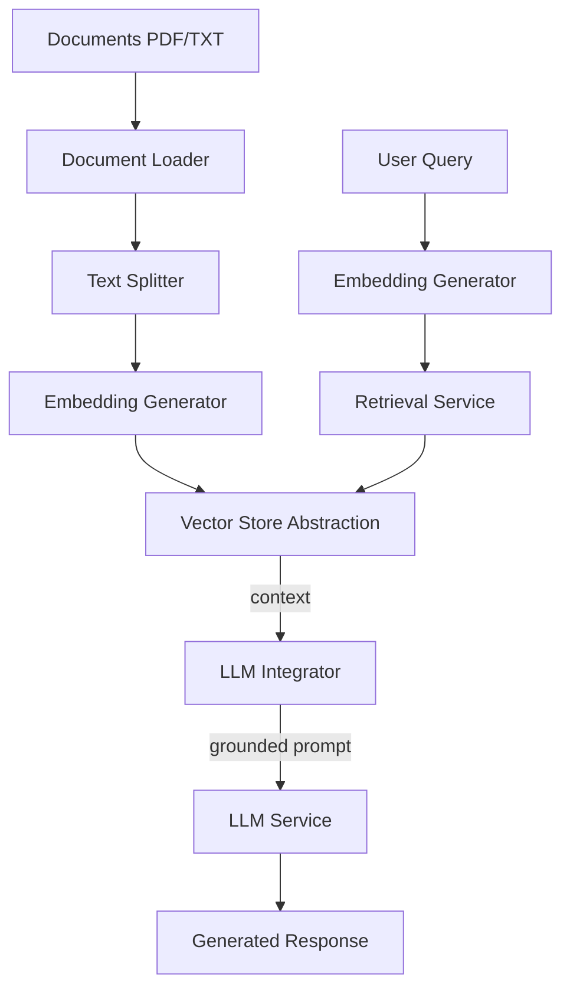

# AI & LLM Services — openwiki

# AI & LLM Services — openwiki

## Purpose

RAG pipeline and LLM orchestration for Omnisight platform. Handles document ingestion, embedding generation, vector search, and grounded response generation.

## Architecture



## Core Components

### Document Ingestion
- **Loaders**: LangChain loaders for PDF/TXT extraction
- **Splitter**: `RecursiveCharacterTextSplitter` — 1000 char chunks, 200 char overlap
- **Rationale**: Overlap preserves semantic continuity across chunks

### Embedding Generation
- **Model**: `all-MiniLM-L6-v2` (Sentence-Transformer)
- **Dimension**: 384
- **Performance**: Real-time document processing speed

### Vector Store Abstraction
```python
# backend/app/modules/llm/rag/vector_store.py
class VectorStore(ABC):
    @abstractmethod
    def add(self, texts: List[str], metadatas: List[Dict]): ...
    
    @abstractmethod
    def search(self, query: str, k: int = 5): ...
```
Swappable implementations via interface.

### Retrieval & Similarity Search
- **Metric**: Cosine distance
- **Index**: HNSW for sub-linear search
- **Filtering**: Metadata filters (user, date, category)

### LLM Integration
- **Prompt Orchestration**: Dynamic construction — system instructions + retrieved context + user query
- **Streaming**: Token-based streaming responses

## Design Decisions

### Decision 1: Hybrid Vector Database
| Environment | Database | Reason |
|-------------|----------|--------|
| Local Dev | ChromaDB | Zero infrastructure, file-based |
| Production | PGVector | ACID compliant, existing PostgreSQL infra |

### Decision 2: Multi-Provider LLM Orchestration
- **Providers**: OpenAI, Anthropic, Local
- **Pattern**: Registry mapping model names → LLM configs
- **Benefit**: No vendor lock-in, fallback support

### Decision 3: Rate Limiting & Budget Protection
- **Implementation**: Middleware throttling LLM requests
- **Context**: LLM inference expensive, high latency
- **Benefit**: Protect resources and budget

## Performance Optimization

### HNSW Index
```sql
CREATE INDEX idx_documents_embedding_hnsw ON documents 
USING hnsw (embedding vector_cosine_ops) 
WITH (m = 16, ef_construction = 64);
```
**Impact**: $O(N)$ → $O(\log N)$, sub-second retrieval at millions of documents

### Embedding Caching
1. **Hash-based**: Store embeddings keyed by text hash
2. **Metadata-aware**: Skip unchanged documents during ingestion

## MLflow Integration
Tracks pipeline performance:
- **Parameters**: Chunk size, overlap, model version
- **Metrics**: Retrieval precision, generation latency, token usage
- **Reproducibility**: Versioned pipeline configs

## Future Enhancements
1. **Hybrid Search**: Vector + BM25 keyword search
2. **Re-ranking**: Cross-encoder second stage
3. **Advanced RAG**: Multi-query, Sub-query, HyDE strategies
4. **Local Fine-tuning**: Domain-specific model tuning

## Code References
- Vector store interface: `backend/app/modules/llm/rag/vector_store.py`
- Document loaders: LangChain-based
- Text splitter: `RecursiveCharacterTextSplitter`
- Embedding model: `all-MiniLM-L6-v2`