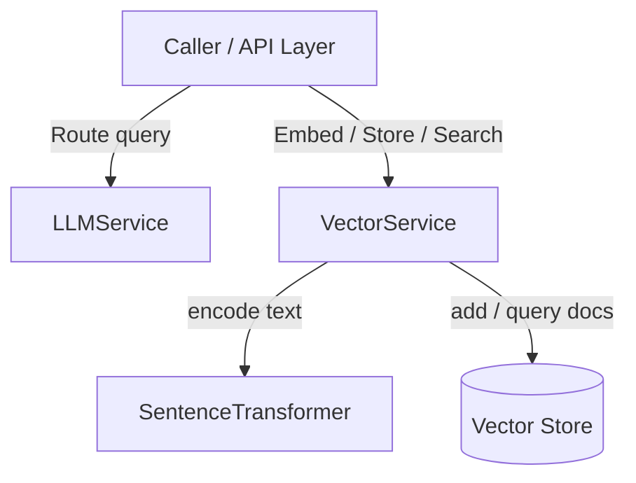

# AI & LLM Services — site

# AI & LLM Services Module

Provides model routing, text embedding generation, and vector store indexing for RAG workflows.



---

## LLM Service

Location: `app/modules/ai/services/llm_service.py`  
Class: `app.modules.ai.services.llm_service.LLMService`

Central orchestrator for LLM operations. Routes requests across registered providers by name.

### State
- `self.providers`: `dict` mapping provider names (`str`) to `LLMProvider` instances.

### Methods

#### `register_provider(name: str, provider: LLMProvider) -> None`
Registers LLM backend instance.

- `name`: Provider identifier string (e.g. `"openai"`).
- `provider`: Object implementing `LLMProvider` interface.

```python
service = LLMService()
service.register_provider("openai", OpenAILogicProvider())
```

---

## Vector Service

Location: `app/modules/ai/services/vector_service.py`  
Class: `app.modules.ai.services.vector_service.VectorService`

Handles local text vectorization and downstream vector store operations.

### Initialization

```python
VectorService(model_name: str = "all-MiniLM-L6-v2")
```
Loads `SentenceTransformer(model_name)` into `self._model`.

### Methods

#### `async generate_embedding(text: str, model: str = "all-MiniLM-L6-v2") -> list[float]`
Encodes raw text to vector float array using local `SentenceTransformer`.

- `text`: Input text string.
- `model`: Model identifier. Default: `"all-MiniLM-L6-v2"`. Reserved for future multi-model routing.
- Returns: `list[float]` embedding vector.

#### `async store_embedding(id: str, text: str, embedding: list[float], metadata: dict | None = None) -> None`
Persists document and vector to store.

- Calls `get_vector_store().add_documents(...)`.
- Document payload structure:
  ```python
  [{"id": id, "document": text, "embedding": embedding, "metadata": metadata}]
  ```

#### `async search(query_embedding: list[float], limit: int = 10) -> list`
Performs nearest-neighbor search in vector store.

- Calls `get_vector_store().search(query_embedding, limit)`.
- Returns: `list` of matching document objects ordered by similarity.

---

## External Integration Points

- `SentenceTransformer`: Model inference backend for embedding generation.
- `get_vector_store()`: Global factory providing active vector database client for insertion and query.