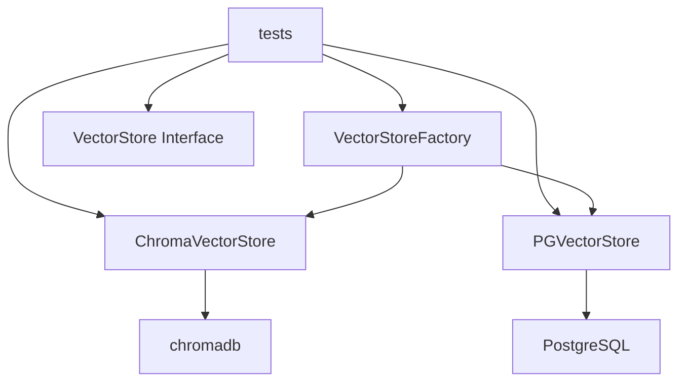

# AI & LLM Services — tests

# AI & LLM Services — Tests Module

## Purpose

Unit tests for vector store implementations used by AI/LLM services. Covers `ChromaVectorStore`, `PGVectorStore`, `VectorStore` interface, and factory pattern.

## Key Components

### Test Files

| File | Tests |
|------|-------|
| `test_chroma_vector_store.py` | ChromaDB vector store operations |
| `test_pgvector_store.py` | PostgreSQL vector store operations |
| `test_vector_store_factory.py` | Factory pattern for store selection |
| `test_vector_store_interface.py` | Interface contract validation |

### Test Classes

- `TestChromaVectorStore` - Tests ChromaDB integration
- `TestPGVectorStore` - Tests PostgreSQL vector store
- `TestVectorStoreFactory` - Tests factory singleton pattern
- `MockVectorStore` - Interface implementation for contract testing

## How It Works

### ChromaVectorStore Tests

Mocks `chromadb.PersistentClient`, tests:
- `add_documents()` - Document insertion
- `search()` - Vector similarity search with metadata filtering
- `delete()` - Document removal
- `health_check()` - Connection validation

### PGVectorStore Tests

Mocks SQLAlchemy async session, tests:
- `add_documents()` - Document insertion via ORM
- `search()` - SQL vector similarity queries
- `health_check()` - Database connectivity

### VectorStoreFactory Tests

Tests singleton factory pattern:
- Default store selection (chroma)
- Explicit store selection (chroma/pgvector)
- Error handling for unknown store types
- Instance caching (same instance returned)

### Interface Contract Tests

Validates `VectorStore` abstract base class contract through `MockVectorStore` implementation.

## Architecture



## Execution Flow

1. Factory tests call `get_vector_store()` → returns cached or new store instance
2. Store tests mock external dependencies (chromadb, SQLAlchemy)
3. Interface tests validate contract compliance via `MockVectorStore`

## Running Tests

```bash
pytest backend/tests/unit/test_chroma_vector_store.py -v
pytest backend/tests/unit/test_pgvector_store.py -v
pytest backend/tests/unit/test_vector_store_factory.py -v
pytest backend/tests/unit/test_vector_store_interface.py -v
```