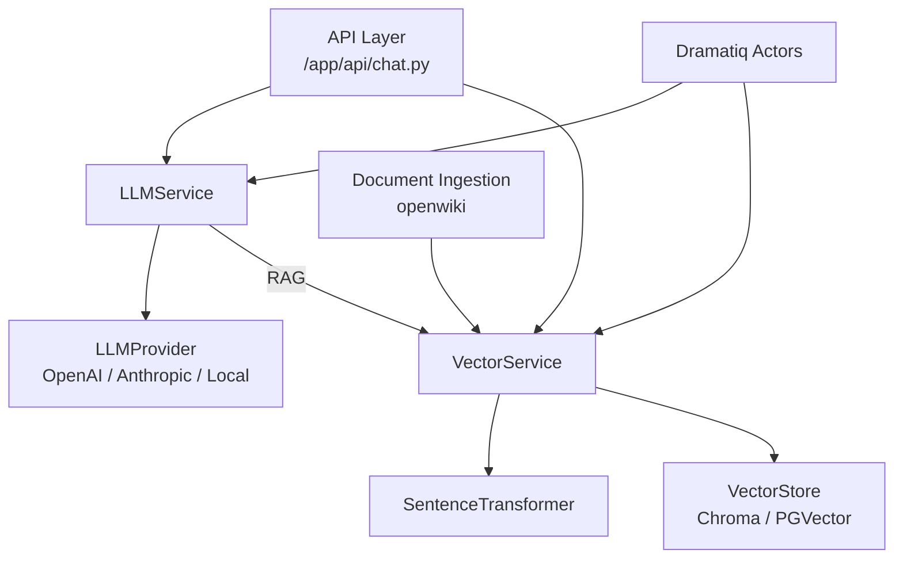

# AI & LLM Services

# AI & LLM Services

## Purpose

Unified LLM orchestration, embedding generation, and RAG pipeline for Omnisight. Routes requests across providers (OpenAI, Anthropic, local), manages vector stores (Chroma, PGVector), executes async via Dramatiq workers.

## Sub-Modules

| Module | Role |
|--------|------|
| [app](app.md) | API endpoints (`/chat`, `/rag_chat`, `/embeddings`), core services (`LLMService`, `VectorService`, `VectorStore`, `LLMProvider`) |
| [openwiki](openwiki.md) | RAG pipeline: document ingestion → split → embed → store → retrieve → grounded generation |
| [site](site.md) | Architecture reference, `LLMService` class docs, provider routing diagram |
| [tests](tests.md) | Vector store contract tests (Chroma, PGVector, factory, interface) |
| [docs](docs.md) | Stub interfaces — no implementation |

## Key Workflows

### Chat Completion (sync/stream)
```
Client → /api/v1/ai/chat → LLMService.generate() → LLMProvider → stream response
```
Provider selected by name via `LLMService.get_provider()`.

### RAG Chat
```
Client → /api/v1/ai/rag_chat → LLMService.generate_with_rag()
  → VectorService.search() → VectorStore.search() → context
  → format_context_for_llm() → LLMProvider.generate_stream() → response
```

### Embedding Generation
```
Client → /api/v1/ai/embeddings → VectorService.generate_embedding()
  → SentenceTransformer.encode() → vector
```
Async batch via Dramatiq: `generate_batch_embeddings` actor.

### Document Ingestion (openwiki)
```
PDF/TXT → DocumentLoader → TextSplitter → EmbeddingGenerator → VectorStore.add_documents()
```

## Architecture



## Cross-Module Calls

| Caller | Callee | Purpose |
|--------|--------|---------|
| `rag_chat_completion` (api) | `generate_with_rag` (llm_service) | Grounded generation |
| `generate_rag_stream` (api) | `stream_chat_with_rag` (llm_service) | Streaming RAG |
| `VectorService.store_embedding` | `get_vector_store` (factory) | Store selection |
| Dramatiq actors | `LLMService.generate`, `VectorService.generate_embedding` | Async offload |

## Testing

- `tests/` validates `VectorStore` interface contract across Chroma/PGVector
- Factory singleton pattern tested
- LLM provider registration tested via `test_llm_service_providers`

## Gaps

- `docs/` stubs only — real implementations in `app/services/`
- `src/` undocumented
- `LLMProvider` adapters mocked, not production-ready