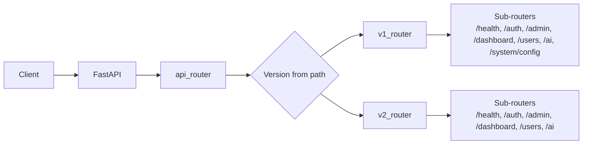

# API Routing & Versioning — app


# API Routing & Versioning

## Overview
Centralized routing layer for all HTTP endpoints. Provides versioned API prefixes (`/v1`, `/v2`), registers module‑specific routers, and supplies authentication dependencies.

## Components

### Version Enumeration (`app/api/versioning.py`)
- `APIVersion` – string enum with `V1 = "v1"`, `V2 = "v2"`.
- `DEFAULT_VERSION` – `APIVersion.V1`.
- `get_version_from_path(path)` – extracts version from URL segment `/vX/`.
- `fallback_version(version)` – returns `V1` for `V2`, otherwise `None`.

### Router Registry (`app/api/version_router.py`)
- `AVAILABLE_VERSIONS: dict[str, APIRouter]` – maps version string to its router.
- `register_version(version, router)` – stores router for a version.
- `get_router_for_version(version)` – returns router for version, falling back via `fallback_version` if direct lookup fails.

### Main Router (`app/api/router.py`)
- `api_router` – top‑level `APIRouter` mounted on the FastAPI app.
- `v1_router`, `v2_router` – version‑specific routers.
- **v1 routes** include:
  - `/health` → `health_router`
  - `/system/config` → `system_config_router`
  - `/auth` → `auth_router`
  - `/admin` → `admin_status_router`, `admin_logs_router`
  - `/dashboard` → `dashboard_router`
  - `/users` → `user_router`
  - `/ai` → `ai_router`
- **v2 routes** include:
  - `/health`, `/auth`, `/admin`, `/dashboard`, `/users`, `/ai` (same routers, different version prefix).
- Both version routers are registered with `register_version`.
- `api_router` includes each version router under its prefix:
  ```python
  api_router.include_router(get_router_for_version(APIVersion.V1), prefix="/v1")
  api_router.include_router(get_router_for_version(APIVersion.V2), prefix="/v2")
  ```

### Authentication Dependencies (`app/api/v1/deps.py`)
- `extract_token_from_request(request)` – retrieves JWT from `Authorization: Bearer` header or `access_token` cookie. Prefers header.
- `get_current_user(request, db)` – validates token via `verify_token`, loads `User` from DB. Raises `401` on failure.
- `get_admin_user(user)` – ensures user has an `admin` role, otherwise raises `403`.

These dependencies are reused across all versioned endpoints.

## Request Flow
1. Client sends HTTP request to `/vX/...`.
2. FastAPI routes request to `api_router`.
3. Router selects version router based on path prefix (`/v1` or `/v2`).
4. Version router dispatches to included sub‑router (e.g., `auth_router`).
5. Endpoint executes, invoking dependencies such as `get_current_user` or `get_admin_user`.

## Version Fallback
If a request targets a version not directly registered, `get_router_for_version` consults `fallback_version`. For example, an unknown version `v3` would receive the `v1` router, ensuring backward compatibility.

## Extensibility
- Add new version: extend `APIVersion` enum, create a new `APIRouter`, include desired sub‑routers, call `register_version`.
- Introduce version‑specific behavior: define separate routers per version; common routers can be shared.
- Modify fallback logic: edit `fallback_version` to implement custom downgrade rules.

## Integration with Modules
- **System**: `/system/config` (v1 only).
- **Auth**: `/auth` (both versions).
- **Admin**: `/admin/status`, `/admin/logs` (both versions).
- **Dashboard**: `/dashboard` (both versions).
- **Users**: `/users` (both versions).
- **AI**: `/ai` (both versions).
- **Health**: `/health` (both versions).

All module routers are imported in `router.py` and attached to the appropriate version router.

## Diagram


## Testing
- `app/api/v1/test_auth_bearer.py` – covers `extract_token_from_request` edge cases.
- `system/tests/test_bearer_auth.py` – validates `get_current_user` with Bearer token and cookie.
- End‑to‑end tests exercise version routing and fallback.