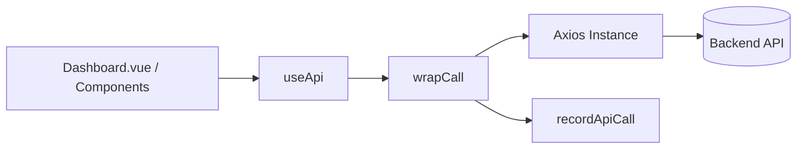

# API Routing & Versioning — src

# API Routing & Versioning — src

Module provide HTTP client layer for backend communication, API version routing, and request performance tracking.



---

## Files

### `frontend/src/shared/api.ts`
Base Axios client for root and unversioned endpoints.

* **Base URL:** `import.meta.env.VITE_API_URL` or `http://localhost:8000`
* **Config:** `withCredentials: true`

#### Functions
* `healthCheck()`: `GET /health`. Return root server status.
* `getApiHealth(version = 'v1')`: `GET /api/${version}/health`. Return versioned API health (`v1` or `v2`).

#### Interceptors
* **Request:** Attach `startTime: new Date()` to `config.metadata`.
* **Response:** Calculate duration `Date.now() - startTime`. Log elapsed time to `console.log`.
* **Error:** Log request failure time to `console.error`. Reject promise.

---

### `frontend/src/shared/useApi.ts`
Singleton Axios instance and composable wrapper for versioned API calls with core metrics integration.

* **Base URL:** `import.meta.env.VITE_API_BASE_URL` or `http://localhost:8000/api/v1`
* **Timeout:** `10000ms`
* **Headers:** `Content-Type: application/json`
* **Config:** `withCredentials: true`

#### Core Exports

* `getApiInstance()`: Return or create singleton `AxiosInstance`. Register 401 response interceptor for unauthorized access logging.
* `useApi()`: Return HTTP wrapper methods. Unpack `response.data` automatically. Track request timing via `performance.now()` and push metrics to `recordApiCall`.

#### Methods in `useApi()`
* `get<T>(url)`: `GET` request wrapped with metric tracking.
* `post<T>(url, data)`: `POST` request wrapped with metric tracking.
* `put<T>(url, data)`: `PUT` request wrapped with metric tracking.
* `delete<T>(url)`: `DELETE` request wrapped with metric tracking.

#### Execution Flow (`wrapCall`)
1. Record `startTime` with `performance.now()`.
2. Execute Axios request and unwrap `res.data`.
3. Success: Calculate `duration`, call `recordApiCall(method, baseURL + url, 200, duration)`, return data.
4. Catch: Calculate `duration`, extract `error.response.status` (default `0`), call `recordApiCall(method, baseURL + url, statusCode, duration)`, rethrow error.

---

## Environment Variables

| Variable | Default | Purpose |
| :--- | :--- | :--- |
| `VITE_API_URL` | `http://localhost:8000` | Base host for general/health requests in `api.ts` |
| `VITE_API_BASE_URL` | `http://localhost:8000/api/v1` | Versioned base endpoint for `useApi.ts` |

---

## Usage Example

```typescript
import { useApi } from '@/shared/useApi'

interface UserData {
  id: string
  name: string
}

const api = useApi()

// GET /api/v1/users/me
const user = await api.get<UserData>('/users/me')

// POST /api/v1/users
await api.post('/users', { name: 'Grok' })
```