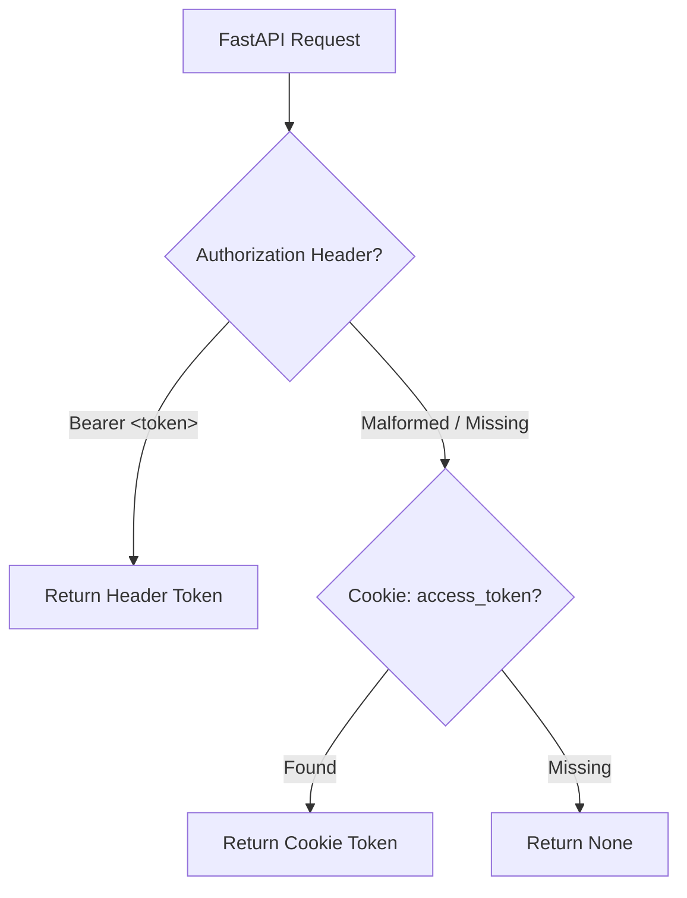

# API Routing & Versioning — tests

# API Routing & Versioning — Auth Bearer Unit Tests

`backend/tests/api/v1/test_auth_bearer.py` verify token extraction logic in API v1 dependency layer.

## Purpose

Validate `app.api.v1.deps.extract_token_from_request`. Ensure correct precedence, header parsing, cookie fallback, malformed input rejection.

## Test Flow

## Test Cases

Module mock raw ASGI `scope` dict in `fastapi.Request` directly. No HTTP server needed.

### `test_extract_token_from_auth_header`
- **Input:** `Authorization: Bearer token123`
- **Expected:** `"token123"`
- **Verifies:** Standard Bearer header parsed.

### `test_extract_token_from_auth_header_missing_bearer_prefix`
- **Input:** `Authorization: token123`
- **Expected:** `None`
- **Verifies:** Header missing `Bearer ` prefix rejected.

### `test_extract_token_from_cookie`
- **Input:** `Cookie: access_token=cookie_token456` (no auth header)
- **Expected:** `"cookie_token456"`
- **Verifies:** Fallback to cookie when header absent.

### `test_extract_token_from_header_priority`
- **Input:** Both `Authorization: Bearer header_token` and `Cookie: access_token=cookie_token`
- **Expected:** `"header_token"`
- **Verifies:** Header overrides cookie.

### `test_extract_token_no_token`
- **Input:** Empty headers
- **Expected:** `None`
- **Verifies:** Missing auth state handled safely.

### `test_token_parsing_edge_cases`
- **Inputs & Expected:**
  - `Authorization: Bearer` -> `None` (empty payload invalid)
  - `Authorization: Bearer token  ` -> `"token  "` (preserves spaces after separator)
  - `Authorization: Bearer token!@#$%` -> `"token!@#$%"` (preserves special characters)

## Integration Points

- **Target:** `app.api.v1.deps.extract_token_from_request`
- **Framework:** `pytest`, `fastapi.Request`
- **Execution:** Run via `pytest backend/tests/api/v1/test_auth_bearer.py`