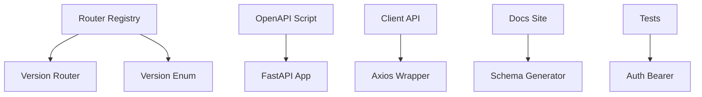

# API Routing & Versioning

# API Routing & Versioning

Centralized API management layer handling versioned endpoints, authentication, documentation, and client integration.

## Architecture

## Sub-modules

- **[app](app.md)** - Core routing with `APIVersion` enum, router registration, and authentication dependencies
- **[docs](docs.md)** - Static documentation serving interactive OpenAPI spec and endpoint reference
- **[scripts](scripts.md)** - OpenAPI schema generation CLI for CI/CD and client SDK generation
- **[site](site.md)** - MkDocs Material documentation site with Redoc integration
- **[tests](tests.md)** - Unit tests for bearer token extraction and auth flows
- **[src](src.md)** - Frontend Axios client with version routing and performance metrics
- **[openwiki](openwiki.md)** - Cross-module dependency mapping and architecture reference

## Key Workflows

**Version Registration**: `APIVersion` enum → `register_version()` → router inclusion at `/api/v1`, `/api/v2`

**Auth Flow**: Request → `extract_token_from_request()` → `get_current_user()` → endpoint authorization

**Schema Generation**: `app.main:app` → `update_openapi.py` → `docs/openapi/openapi.json` → docs site

**Client Calls**: `useApi()` → `wrapCall()` → Axios → backend API with version prefix