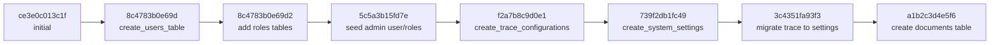

# Core Architecture & Infrastructure — alembic

# Alembic Database Migrations

Manages database schema changes. Uses Alembic with SQLAlchemy models.

## Purpose

Track database schema changes over time. Apply upgrades, rollback downgrades. Keep schema synchronized across environments.

## Structure

`backend/alembic/`
- `env.py` – Main configuration, entry point
- `script.py.mako` – Migration file template
- `versions/` – Individual migration scripts
- `README` – Generic config note

## Configuration (`env.py`)

Key setup:
- Adds app directory to `sys.path` for model imports
- Uses `Base.metadata` from `app.modules.core.database` for autogenerate
- Sets database URL from `settings.DATABASE_URL`
- Imports all SQLAlchemy models (`User`, `SystemSetting`, `Document`) to ensure Alembic detects them

Two modes:
- `run_migrations_offline()` – Generates SQL scripts without database connection
- `run_migrations_online()` – Connects to database and applies migrations directly

## Migration Files

Each file in `versions/` follows pattern: `{revision_hash}_{description}.py`

Template (`script.py.mako`) generates:
- Revision identifiers (`revision`, `down_revision`)
- `upgrade()` and `downgrade()` functions

## Migration History

Current revision chain:



## Key Migrations

### User & Role System
- `8c4783b0e69d`: Creates `users` table with email/password
- `8c4783b0e69d2`: Creates `roles` and `user_roles` junction table
- `5c5a3b15fd7e`: Seeds admin user (`admin@example.com`/`admin123`) and admin/user roles

### System Settings
- `739f2db1fc49`: Creates `system_settings` table (key-value JSON storage)
- `3c4351fa93f3`: Migrates old `trace_configurations` data into `system_settings`

### RAG Documents
- `a1b2c3d4e5f6`: Creates `documents` table with pgvector HNSW index (PostgreSQL only). Skips on SQLite.

## Usage

Create new migration (autogenerate from model changes):
```bash
alembic revision --autogenerate -m "description"
```

Apply all pending migrations:
```bash
alembic upgrade head
```

Rollback one migration:
```bash
alembic downgrade -1
```

Generate SQL script without applying:
```bash
alembic upgrade head --sql
```

## Dependencies

- `app.modules.core.config.settings` – Database URL
- `app.modules.core.database.Base` – SQLAlchemy metadata for autogenerate
- `app.modules.core.security.hash_password` – For password hashing in seed migration
- All SQLAlchemy model imports in `env.py` must be kept current

## Notes

- Migration `a1b2c3d4e5f6` is PostgreSQL-specific (requires pgvector). SQLite environments skip it.
- Always test downgrades before deploying.
- Seed data migrations (`5c5a3b15fd7e`) include passwords – change default in production.
- `env.py` imports models explicitly; add new models here when creating tables.