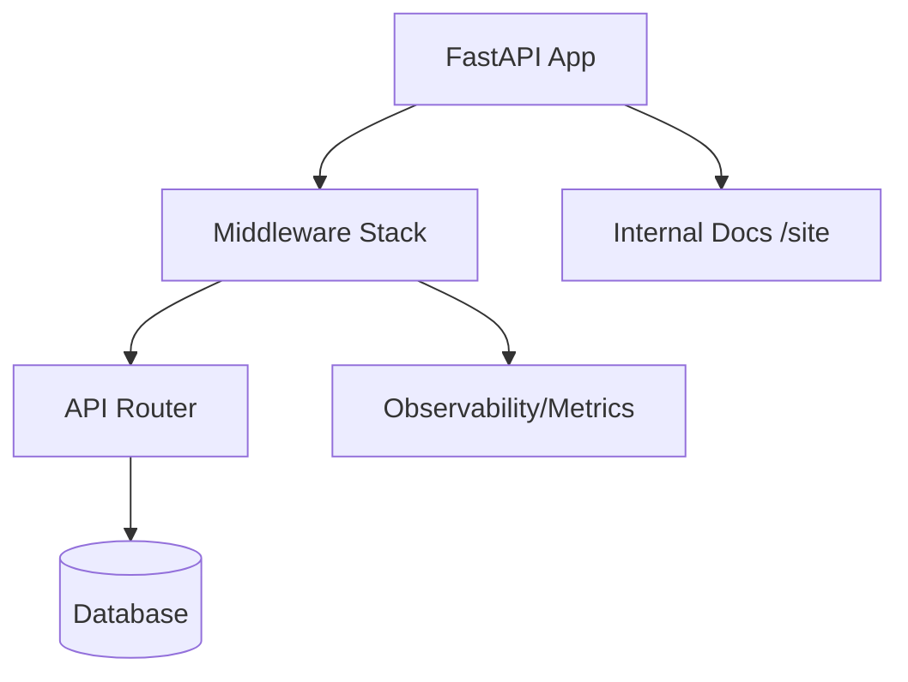

# Core Architecture & Infrastructure — app

# Core Architecture & Infrastructure

Central module for application lifecycle, configuration, and shared services.

## Application Entry Point (`app/main.py`)

`create_app()` factory builds `FastAPI` instance. Configure middleware, exception handlers, and routes.

### Middleware Stack
Order of execution:
1.  `RequestIDMiddleware`: Generate/inject `X-Request-ID` header.
2.  `CostTrackingMiddleware`: Track AI usage costs.
3.  `RateLimitingMiddleware`: Prevent API abuse.
4.  `CORSMiddleware`: Manage cross-origin access via `settings.CORS_ORIGINS`.

### Exception Mapping
Custom handlers convert exceptions to `JSONResponse` with `X-Request-ID` for tracing:
*   `AuthException`: Return specific `error_code` and status.
*   `HTTPException`: Standard FastAPI errors.
*   `Exception`: Catch-all for 500 Internal Server Errors.

## Configuration (`modules/core/config.py`)

`Settings` class use `pydantic-settings` to load environment variables.
*   **Source**: `.env` file or system environment.
*   **Key Vars**: `DATABASE_URL`, `REDIS_URL`, `SECRET_KEY`, `OTEL_COLLECTOR_ENDPOINT`.
*   **Defaults**: Optimized for local development (e.g., SQLite, local Redis).

## Database Management (`modules/core/database.py`)

SQLAlchemy setup for persistence.
*   `engine`: Configured for SQLite (local) or Postgres (production with connection pooling).
*   `SessionLocal`: Factory for database sessions.
*   `get_db()`: Dependency provider. Yield session, auto-close after request.

## Security (`modules/core/security.py`)

Identity and access control utilities.
*   `hash_password(password)`: Bcrypt hashing with salt.
*   `verify_password(plain, hashed)`: Bcrypt verification.
*   `create_access_token(data, expires)`: Generate JWT using `HS256` and `settings.SECRET_KEY`.
*   `verify_token(token)`: Decode JWT; return payload or `None` if invalid/expired.

## Observability & Logging

*   **Logging (`modules/core/logging.py`)**: `setup_logging()` configures JSON format for console and file (`server.log`). Include timestamp, level, and message.
*   **Tracing**: `RequestIDMiddleware` ensures every log entry can link to a specific request.
*   **Metrics**: `Instrumentator` exposes Prometheus metrics at `/metrics`.
*   **Health**: `/health` endpoint checks app status and database connectivity.

## Testing Infrastructure (`app/conftest.py`)

Pytest fixtures for integration testing.
*   `session`: Function-scoped. Create clean SQLite `test.db` for every test.
*   `client`: `TestClient` using `app` instance with `get_db` dependency overridden to use the test session.
*   **Env**: `LOG_FILE_PATH` forced to `./test.log` to avoid polluting production logs.

## Versioning (`modules/core/version.py`)

`get_version()` parse `pyproject.toml` via regex. Fallback to `0.0.0` if file missing. Used in FastAPI metadata.

→ skipped: auto-migration in `lifespan`, add when DB schema stabilize.
→ skipped: Redis health check, add when caching become critical path.