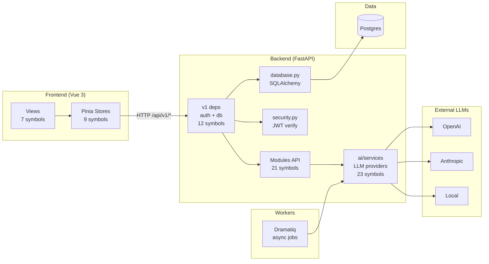

# Core Architecture & Infrastructure — ARCHITECTURE.md

# Architecture

## Purpose

GitNexus demonstrates FastAPI backend + Vue 3 frontend integration. Modular structure separates domains into `backend/app/modules/<feature>/`. Exposes REST API under `api/v1`, persists via SQLAlchemy to Postgres, offloads work to Dramatiq workers, proxies LLM calls to swappable providers.

## Structure

```
backend/app/
├── api/v1/           # Versioned deps: auth, db session, admin guard
├── modules/
│   ├── core/         # database.py, security.py, config.py
│   ├── ai/           # LLM providers, chat endpoints, actors
│   ├── system/       # config, tracing
│   ├── users/        # user management
│   └── admin/        # admin operations
frontend/src/
├── views/            # Vue page components
└── stores/           # Pinia stores
```

## Key Components

### API Layer (`modules/*/api/`)
Routers per domain. Mounted under `api/v1`. Each router uses deps from `api/v1/deps.py`.

### Services (`modules/*/services/`)
Business logic. LLM service (`ai/services/llm_service.py`) manages provider registry + chat/stream/generate.

### Actors (`modules/*/actors/`)
Dramatiq background workers. Handle async LLM jobs.

### Core (`modules/core/`)
Shared infrastructure:
- `database.py` — SQLAlchemy session management
- `security.py` — JWT verify, token extraction
- `config.py` — application configuration

### Dependency Chain
Protected endpoints use:
```
get_current_user → get_db
```
Admin endpoints prepend:
```
get_admin_user → get_current_user → get_db
```

## Execution Flows

### Chat Completion
```
chat_completion → generate → stream_chat → generate_stream → get_provider
```
Path: `backend/app/modules/ai/api/chat.py` → `backend/app/modules/ai/services/llm_service.py`

### Config Read (Protected)
```
get_config → get_admin_user → get_current_user → get_db
```
Path: `modules/system/api/config.py` → `api/v1/deps.py` → `modules/core/database.py`

### Token Extraction
```
get_config → get_admin_user → get_current_user → extract_token_from_request
```

### Token Verification
```
get_config → get_admin_user → get_current_user → verify_token
```
Path: `modules/core/security.py`

## Data Flow



## Module Boundaries

- `backend/app/modules/<feature>/` — each domain owns `api/`, `services/`, `actors/`, `models/`, `tests/`
- `backend/app/api/v1/` — dependency injection + router mounting
- `backend/app/modules/core/` — shared `database.py`, `security.py`, `config.py`
- Frontend: `frontend/src/views/`, `frontend/src/stores/`

## Cohesion Clusters

| Area | Symbols | Cohesion | Role |
|---|---|---|---|
| Tests | 45 | 77% | pytest suite |
| Services | 23 | 87% | LLM provider registry |
| Api | 21 | 90% | FastAPI routers |
| V1 | 12 | 96% | deps wiring |
| Stores | 9 | 100% | Pinia stores |
| Views | 7 | 100% | Vue components |
| Actors | 5 | 73% | Dramatiq workers |
| Cluster_15 | 5 | 100% | focused cluster |
| __init__ | 5 | 100% | module surface |