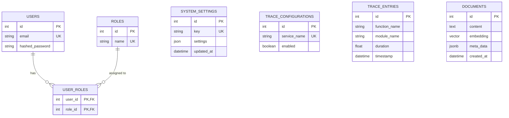

# Core Architecture & Infrastructure — architecture

# Core Architecture & Infrastructure — Architecture Module

## Purpose

Defines system-wide data structures, access control model, observability infrastructure, and RAG vector storage schema. Single source of truth for database design.

## Database Schema

### Entity Relationship Diagram



## Components

### 1. User & Access Control (RBAC)

**Tables:**
- `users`: Identity storage (email, hashed_password)
- `roles`: Permission levels (admin, user, etc.)
- `user_roles`: Junction table for many-to-many mapping

**Usage:**
```sql
-- Check user permissions
SELECT r.name FROM users u
JOIN user_roles ur ON u.id = ur.user_id
JOIN roles r ON ur.role_id = r.id
WHERE u.email = 'user@example.com';
```

### 2. System Settings

**Table:** `system_settings`
- Key-value store for runtime configuration
- Settings stored as JSON
- Real-time feature toggling without restarts

**Pattern:**
```python
# Read setting
settings = db.query(SystemSettings).filter_by(key="feature.toggle").first().settings

# Update setting
db.query(SystemSettings).filter_by(key="feature.toggle").update({"settings": {"enabled": True}})
```

### 3. Observability & Tracing

**Tables:**
- `trace_configurations`: Per-service trace toggles (deprecated)
- `trace_entries`: Performance metrics (function_name, module_name, duration, timestamp)

**Migration:** Move trace settings to `system_settings` with key pattern `tracing.{service_name}`

### 4. Vector Database / RAG

**Table:** `documents`
- `content`: Chunked text documentation
- `embedding`: 384-dimension vector (PGVector)
- `meta_data`: JSONB for filtering (domain, category, etc.)
- `created_at`: Document timestamp

**Embedding Model:** `all-MiniLM-L6-v2`

**Query Pattern:**
```sql
-- Similarity search
SELECT content, meta_data 
FROM documents 
WHERE meta_data->>'domain' = 'api'
ORDER BY embedding <=> '[vector_data]' 
LIMIT 5;
```

## Integration Points

### Authentication Layer
User credentials from `users` table feed into auth middleware. Role checks query `user_roles` → `roles`.

### Configuration Management
`system_settings` read at startup and cached. Changes propagate via polling or push notifications.

### Tracing System
`trace_entries` populated by instrumentation decorators. Sampling controlled by `trace_configurations` (migrate to `system_settings`).

### RAG Pipeline
Document ingestion writes to `documents`. Embedding generation uses `all-MiniLM-L6-v2`. Retrieval queries use PGVector operators.

## Migration Notes

- `trace_configurations` → `system_settings` with key `tracing.{service_name}`
- All new settings use `system_settings` key pattern `namespace.setting_name`