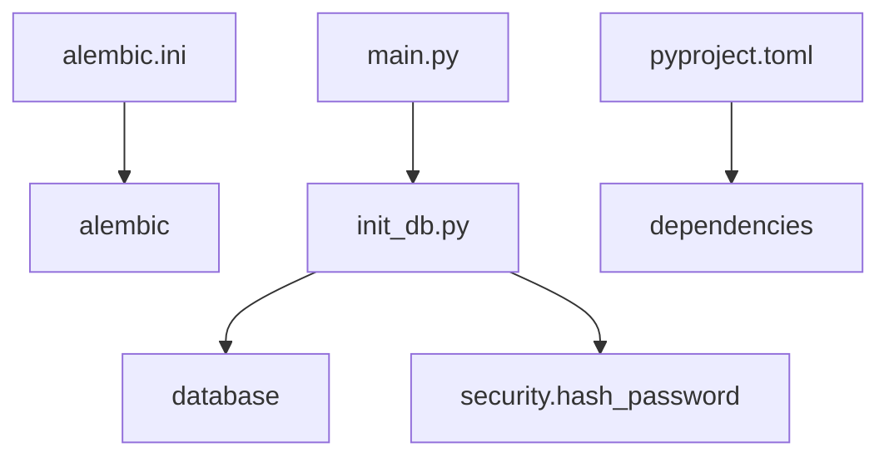

# Core Architecture & Infrastructure — backend

## Core Architecture & Infrastructure — backend

### Purpose
Initialize database, manage migrations, seed default data, provide testing hooks.

### Components
- alembic.ini: migration config, DB URL, logging.
- init_db.py: schema creation, token sync, role/user seeding, system settings.
- main.py: entry point, prints greeting.
- mutmut.conf.py: mutation test filters.
- pyproject.toml: dependencies, package discovery.
- pytest.ini: coverage options.

### Execution flow
Lifespan → init_db → hash_password
init_db → create tables
init_db → read .token, generate if missing
init_db → store token in SystemSetting
init_db → create Role admin, user
init_db → create User admin@example.com with password admin123
init_db → set SystemSetting keys: system.tracing, system.auth_method, system.token_expiry_hours
init_db → load .env into SystemSetting

### External interfaces
- SQLAlchemy engine, Session, Base
- Alembic migration scripts
- FastAPI lifespan
- OpenTelemetry instruments
- Prometheus exporter
- ChromaDB, pgvector, sentence-transformers, MLflow, LangChain

### Configuration
- DB URL: sqlite:///./data/app.db
- Bearer token: .token file, synced to SystemSetting
- Admin credentials: admin@example.com / admin123
- Auth method: cookie_or_bearer
- Token expiry: 24h

### Testing
- pytest with coverage on app
- mutmut skips tests, migrations

### Extension
- Add SystemSetting keys in init_db or migration
- Create new Role instances
- Register additional lifespan tasks in app/main.py