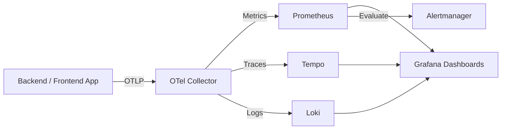

# Core Architecture & Infrastructure — CONTEXT.md

# Observability & Infrastructure Architecture

Observability stack for centralized metrics, logs, traces. Uses OpenTelemetry (OTel), Prometheus, Loki, Tempo, Grafana.

## Telemetry Pipeline

## Core Components

### 1. Telemetry Collection
- **OTel Collector**: Ingests traces, metrics, logs via OTLP. Routes data to backend storage systems.
- **Trace Context Propagation**: Passes Trace IDs across service and async boundaries (e.g., Dramatiq actors) for end-to-end request tracing.
- **Log Correlation**: Injects Trace ID into structured logs for direct trace-to-log pivoting in Grafana.

### 2. Monitoring & Alerts
File: `dockerdata/observability/prometheus/alerts.yml`

| Alert Name | Condition | Window | Severity / Trigger |
|---|---|---|---|
| `HighErrorRate` | 5xx HTTP responses > 5% | 5m | Service degradation |
| `ServiceDown` | `up == 0` | 1m | Outage / Pod failure |

### 3. Dashboards
Location: `dockerdata/observability/grafana/provisioning/dashboards/`
- `backend-observability.json`: Backend health, request throughput (RPS), error rates, latency percentiles.
- `frontend-observability.json`: Client-side performance, frontend component metrics, user interaction tracking.

### 4. Kubernetes Runtime Configuration
File: `kubernetes/backend-deployment.yaml`
- **Workload Type**: `kind: Deployment`. Uses rolling update strategy for zero downtime.
- **Environment Ingestion**: Injects `OTEL_EXPORTER_OTLP_ENDPOINT` pointing to cluster OTel Collector service.

## Critical Failure Modes & Operational Edge Cases

- **OTel Collector Backpressure**: High traffic bursts cause memory spikes in Collector. Dropped spans/metrics occur if buffers saturate before flush to Loki/Prometheus.
- **Metric Cardinality Spikes**: Raw user IDs or unindexed paths inside Prometheus label sets degrade TSDB storage. Restrict labels to bounded enum values.
- **Async Trace Dropping**: Tasks enqueued to Dramatiq drop trace context if worker middleware fails to unpack metadata headers.
- **Loki Ingestion Lag**: Excessive unindexed log spam causes ingestion queues to back up. Require structured JSON formatting across services.