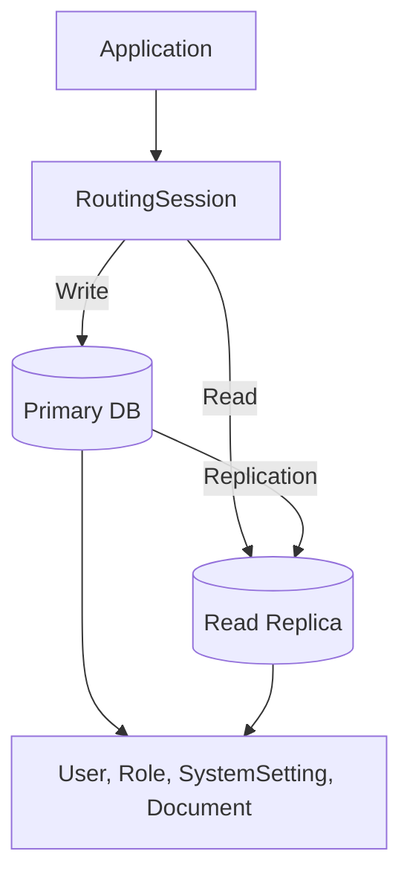

# Core Architecture & Infrastructure — database

# Core Architecture & Infrastructure — Database

## Purpose

Database layer optimization patterns and connection routing for PostgreSQL. Covers query performance, JSONB indexing, vector search, and read-replica readiness.

---

## Key Components

| Component | File | Role |
|-----------|------|------|
| Query Examples | `docs/database/query-examples.md` | Optimization patterns reference |
| Session Factory | `backend/app/core/database.py` | RoutingSession, engine config |
| Models | `backend/app/models/` | User, Role, SystemSetting, Document |

---

## Optimization Patterns

### 1. N+1 Prevention — Eager Loading

**Problem**: Accessing `user.roles` in loop triggers N queries.

**Fix**: `joinedload(User.roles)` → single JOIN query.

```python
from sqlalchemy.orm import joinedload
users = db.query(User).options(joinedload(User.roles)).all()
```

### 2. JSONB Search — GIN Index

**Problem**: `settings['tracing']['enabled']` scan = O(N) sequential.

**Fix**: GIN index + containment operator.

```sql
CREATE INDEX idx_system_settings_jsonb_gin ON system_settings USING gin (settings);
```

```python
settings = db.query(SystemSetting).filter(
    SystemSetting.settings.contains({"tracing": {"enabled": True}})
).all()
```

### 3. Vector Search — HNSW Index (PGVector)

**Problem**: Exact cosine distance on 100k+ rows = slow.

**Fix**: HNSW approximate nearest neighbor.

```sql
CREATE INDEX idx_documents_embedding_hnsw ON documents 
USING hnsw (embedding vector_cosine_ops) 
WITH (m = 16, ef_construction = 64);
```

```python
nearest_docs = db.query(Document).order_by(
    Document.embedding.cosine_distance(query_embedding)
).limit(5).all()
```

### 4. Read Replica Routing

**Implementation**: `backend/app/core/database.py`

```python
class RoutingSession(Session):
    def get_bind(self, mapper=None, clause=None):
        if self._flushing or (clause is not None and not clause.is_select):
            return engines['writer']
        return engines['reader']

engines = {
    'writer': create_engine(settings.DATABASE_WRITE_URL, pool_size=10, max_overflow=20),
    'reader': create_engine(settings.DATABASE_READ_URL, pool_size=15, max_overflow=30)
}
SessionLocal = sessionmaker(class_=RoutingSession, autocommit=False, autoflush=False)
```

---

## Architecture



---

## Integration Points

- **Models** define columns: `User.roles` (relationship), `SystemSetting.settings` (JSONB), `Document.embedding` (vector)
- **Alembic migrations** create GIN/HNSW indexes
- **Settings** (`settings.DATABASE_WRITE_URL`, `settings.DATABASE_READ_URL`) configure engines
- **Services** use `SessionLocal()` → auto-routes via `RoutingSession`

---

## Usage Checklist

- [ ] Add `joinedload` for all relationship accesses in loops
- [ ] Create GIN index on JSONB columns before querying nested keys
- [ ] Create HNSW index on vector columns before similarity search
- [ ] Configure `DATABASE_READ_URL` for replica routing
- [ ] Monitor `pg_stat_statements` for query performance

---

## Files

```
docs/database/query-examples.md          # This reference
backend/app/core/database.py             # RoutingSession, engines
backend/app/models/user.py               # User, Role
backend/app/models/system_setting.py     # SystemSetting (JSONB)
backend/app/models/document.py           # Document (vector)
alembic/versions/                        # Index migrations
```