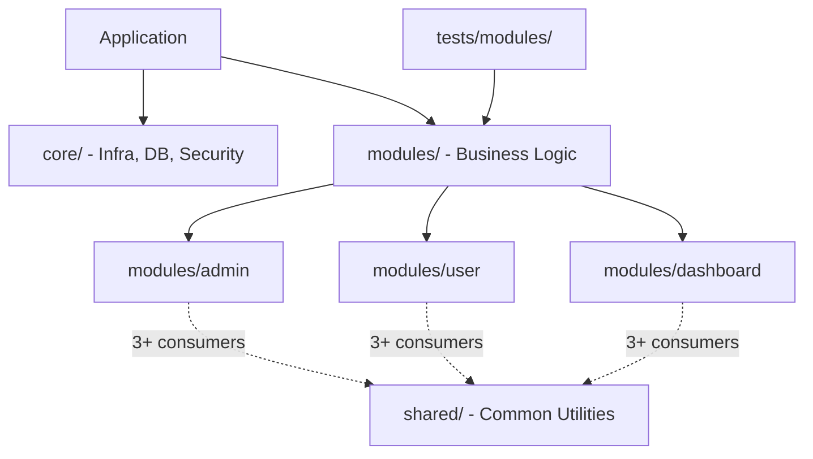

# Core Architecture & Infrastructure — project.md

# Core Architecture & Infrastructure

Architecture documentation defines structural boundaries, directory conventions, code sharing rules.

## Module Layout

## Directory Responsibilities

- `core/`: Application-level infrastructure. DB configuration, security middleware, base runtime setup.
- `modules/`: Domain isolation. Each folder (`admin`, `user`, `dashboard`) holds isolated business logic.
- `shared/`: Generic utilities. Code lives here only if consumed by 3+ business modules.
- `tests/`: Module-mirrored test hierarchy. Test files live in `tests/modules/<module-name>/`.

## Architectural Constraints

- **Cross-module imports:** Do not use relative imports across module boundaries (avoid `../../other-module`). Use path aliases.
- **Shared threshold:** Code used by 1 or 2 modules stays inside those modules. Move to `shared/` only when 3rd module requires it.
- **Test location:** Tests mirror module layout. Do not put domain tests in root test folder; use `tests/modules/<module-name>/`.