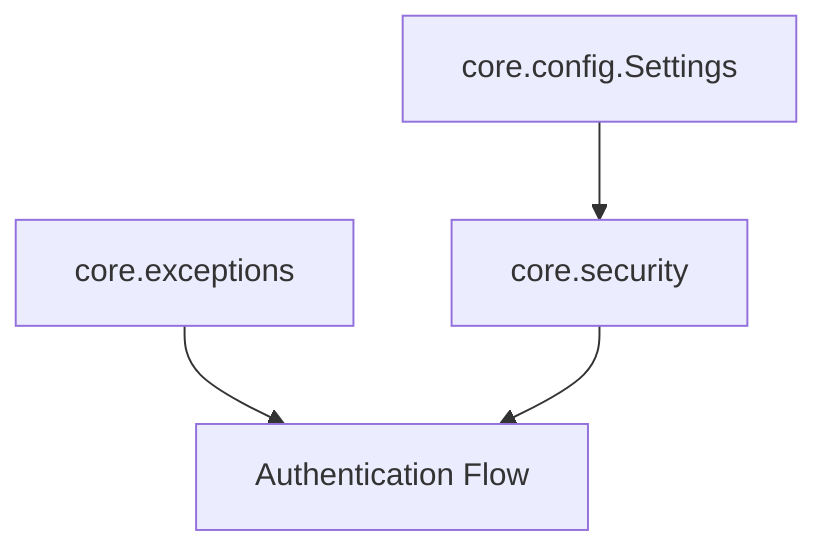

# Core Architecture & Infrastructure — site

# Core Architecture & Infrastructure — site

Pre-built static documentation site generated by MkDocs Material. Serves internal API reference and architecture docs for backend modules (`core`, `user`, `ai`).

## Layout

```
backend/site/
└── modules/
    └── core/
        ├── config/index.html      # Settings documentation
        ├── exceptions/index.html  # Error hierarchy documentation
        └── security/index.html    # Auth and hashing utilities documentation
```

## Documented Subsystems



### 1. Configuration (`app.modules.core.config`)

Pydantic settings loaded from environment or `.env` files.

| Attribute | Default Value | Purpose |
| :--- | :--- | :--- |
| `DATABASE_URL` | `sqlite:///./app.db` | Primary database connection string |
| `REDIS_URL` | `redis://localhost:6379/0` | Cache and message broker connection |
| `SECRET_KEY` | `change-me-in-production` | Secret for cryptographic signing (JWT) |
| `CORS_ORIGINS` | `http://localhost:5173` | Allowed CORS origins |

### 2. Exceptions (`app.modules.core.exceptions`)

Structured error types inheriting from base `AuthException`.

* `AuthException(detail: str, error_code: str, status_code: int = 400)`: Root exception. Stores human-readable `detail`, machine-readable `error_code`, and HTTP `status_code`.
* `EmailAlreadyExistsError(detail='Email already registered')`: `status_code=409`, `error_code="EMAIL_ALREADY_EXISTS"`.
* `InvalidCredentialsError(detail='Incorrect email or password')`: `status_code=401`, `error_code="INVALID_CREDENTIALS"`.
* `ValidationError(detail='Validation failed')`: `status_code=422`, `error_code="VALIDATION_ERROR"`.
* `TokenExpiredError(detail='Token has expired')`: `status_code=401`, `error_code="TOKEN_EXPIRED"`.

### 3. Security Utilities (`app.modules.core.security`)

Password hashing and JWT token operations.

* `hash_password(password: str) -> str`: Hashes UTF-8 string with `bcrypt.gensalt()`.
* `verify_password(plain_password: str, hashed_password: str) -> bool`: Verifies plaintext password against bcrypt hash.
* `create_access_token(data: dict, expires_delta: timedelta | None = None) -> str`: Encodes payload to HS256 JWT. Expiration defaults to 15 minutes.
* `verify_token(token: str) -> dict | None`: Decodes HS256 JWT using `settings.SECRET_KEY`. Catches `JWTError` and returns `None` on failure.