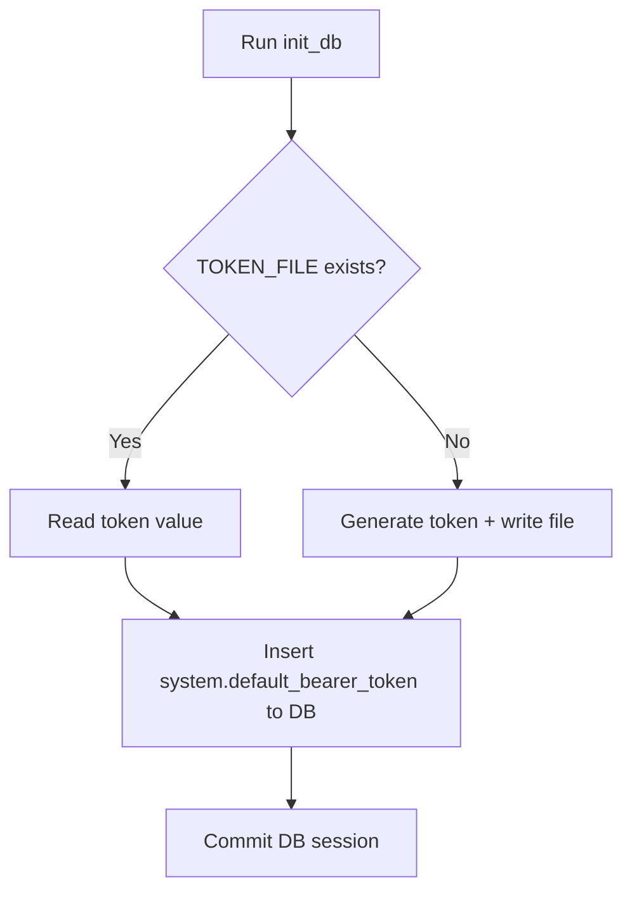

# Core Architecture & Infrastructure — tests

# Core Architecture & Infrastructure — Tests: Database Initialization

Module verifies database bootstrap logic in `backend/init_db.py`. Ensures default bearer token creates correctly on startup, either read from disk or generated fresh.

## Purpose

`tests/system/test_init_db.py` tests `init_db()` behavior:
1. Load existing token from `TOKEN_FILE` into DB.
2. Generate new secret token, write to `TOKEN_FILE`, and persist to DB when file absent.

## Flow

## Test Cases

### `test_init_db_seeds_token_from_file`
- **Target**: `init_db()`
- **Scenario**: `.token` file exists in workdir.
- **Mocks**:
  - `init_db.SessionLocal`: Returns mock `sqlalchemy.orm.Session`.
  - DB query chain (`mock_db.query().filter().first()`): Returns `None` (table empty).
- **Assertions**:
  - `SystemSetting` object with key `system.default_bearer_token` added to DB session via `mock_db.add()`.
  - Setting value matches contents of `.token` file (`"existing-secret-token"`).
  - `mock_db.commit()` invoked.

### `test_init_db_generates_new_token`
- **Target**: `init_db()`
- **Scenario**: `.token` file absent.
- **Mocks**: Same as above.
- **Assertions**:
  - `TOKEN_FILE` created on disk.
  - Generated token file not empty.
  - Matching token value written to DB under key `system.default_bearer_token`.

## Key Dependencies & Integrations

- `init_db.init_db`: Main bootstrap entrypoint.
- `init_db.TOKEN_FILE`: Target filename for bearer token storage on filesystem.
- `app.modules.system.models.system_setting.SystemSetting`: SQLAlchemy model for key-value system settings.
- `pytest` + `tmp_path`: Provides clean temporary directory via `os.chdir(tmp_path)` to isolate disk reads/writes during test runs.