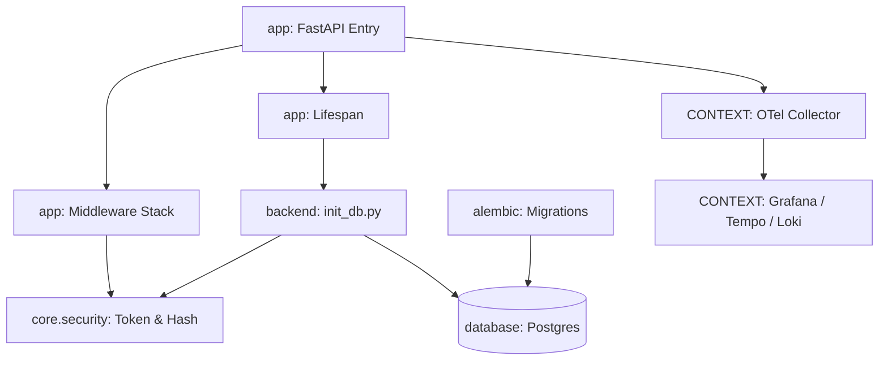

# Core Architecture & Infrastructure

# Core Architecture & Infrastructure

Core module group manage runtime initialization, data persistence, security baseline, and telemetry pipeline.

## Sub-Modules

- [Architecture Overview](ARCHITECTURE.md): System topography, directory conventions, Vue 3 + FastAPI domain structure.
- [Project Boundaries](project.md): Module dependencies and shared utilities rules.
- [Application Entry & Middleware](app.md): FastAPI factory (`create_app`), request ID injection, rate limiting, exception mapping.
- [Backend Bootstrap](backend.md): Root initialization entrypoints, dependency configuration (`pyproject.toml`), test hooks.
- [Database Configuration](database.md): SQLAlchemy connection routing, session factory, query optimization patterns.
- [Database Schema](architecture.md): Relational entities (`User`, `Role`, `SystemSetting`, `Document`) and vector storage layout.
- [Database Migrations](alembic.md): Alembic environment (`env.py`), autogenerate metadata tracking, migration execution.
- [Database Initialization Tests](tests.md): Verification test suites for bootstrap logic and bearer token creation in `init_db.py`.
- [Observability Pipeline](CONTEXT.md): OpenTelemetry collector setup, trace context propagation, Prometheus/Tempo/Loki ingestion.
- [Setup & Toolchain](setup.md): Environment dependencies, Node.js toolchain, OpenSpec CLI integration.
- [Core Docs Specifications](docs.md): Source API reference for config settings, exception trees, security helpers.
- [Documentation Site](site.md): MkDocs Material build output and static asset hierarchy.

## Key Cross-Module Workflows

### 1. Application Startup & Bootstrap
1. `create_app()` in [app](app.md) invokes lifespan context.
2. Lifespan calls `init_db()` in [backend](backend.md).
3. `init_db()` applies metadata schema against [database](database.md) session, seeds admin user credentials with `hash_password()` from [docs](docs.md), and reads or generates default bearer token verified by [tests](tests.md).
4. [alembic](alembic.md) tracks runtime schema changes against models declared in [architecture](architecture.md).

### 2. Request Security & Dependency Resolution
1. Incoming HTTP request hits middleware stack in [app](app.md) (`RequestIDMiddleware` assigns tracing ID).
2. Endpoint dependencies (`api/v1/deps.py`) call `get_current_user` -> `verify_token` in `core.security`.
3. Database sessions inject via `get_db` from [database](database.md).
4. Request execution logs and metrics stream through OTLP pipeline in [CONTEXT](CONTEXT.md).