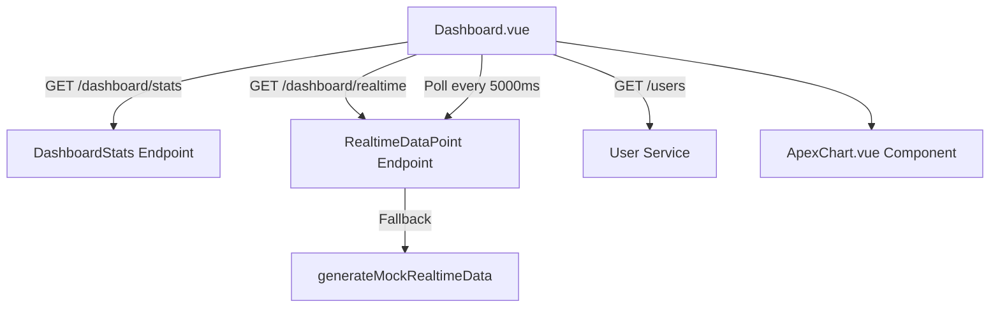

# Dashboard & Analytics

# Dashboard & Analytics Module

Module provides real-time system metrics, user stats, and performance visual charts. Consists of FastAPI backend endpoints and Vue 3 + Vuetify + ApexCharts frontend views.

## Backend API

Endpoints defined in `backend/app/modules/dashboard/api/dashboard.py`. Base router mounts to `/api/v1/dashboard`.

### Models

- **`DashboardStats`**: System counters.
  - `total_users` (`int`): Registered user count.
  - `active_sessions` (`int`): Current active sessions.
  - `api_calls_24h` (`int`): Requests in last 24 hours.
- **`RealtimeDataPoint`**: Time-series metrics block.
  - `timestamp` (`str`): ISO datetime string.
  - `requests` (`int`): Request throughput.
  - `avgResponseTime` (`float`): Latency in milliseconds.
  - `status2xx` (`int`): Successful response count.
  - `status4xx` (`int`): Client error count.
  - `status5xx` (`int`): Server error count.
  - `activeUsers` (`int`): Concurrently active users.

### Endpoints

- `GET /stats`: Returns `DashboardStats` object. Generates randomized mock values.
- `GET /realtime`: Returns `list[RealtimeDataPoint]` containing single latest snapshot.

*Note:* `backend/app/modules/user/api/dashboard.py` contains alternate static stats endpoint (`total_users: 1250, active_sessions: 42, api_calls_24h: 15420`).

---

## Frontend Components

### `Dashboard.vue`
Path: `frontend/src/modules/dashboard/views/Dashboard.vue`.

Main dashboard layout. Handles state management, data polling, error boundaries, rendering.

- **Metrics Tracking**: Calls `useComponentRenderMetrics()` on setup.
- **Data Fetching (`fetchData`)**: Fires concurrent requests via `Promise.all` using `useApi()` wrapper:
  - `/dashboard/stats`
  - `/users`
  - `/dashboard/realtime`
- **Polling Loop (`startRealtimeUpdates`)**:
  - Runs `setInterval` every 5000ms.
  - Appends new item to `realtimeData` array, maintains sliding window of 20 points.
  - If backend returns empty array or network fails, mutates local history using jitter offsets in client memory.
- **Visuals**:
  - 3 Top stat cards (Total Users, Active Sessions, 24h Calls).
  - 4 ApexCharts:
    1. **Area**: `realtimeSeries` (Request count trends).
    2. **Line**: `distributionSeries` (Average latency ms).
    3. **Donut**: `statusSeries` (2xx, 4xx, 5xx distribution).
    4. **Bar**: `usersSeries` (Active users over time intervals).
  - 1 Vuetify `v-data-table` listing users (`id`, `name`, `email`, `status`).

### `ApexChart.vue`
Path: `frontend/src/modules/shared/components/ApexChart.vue`.

Thin wrapper over `apexcharts` library.

- **Props**:
  - `title` (`String`): Card title.
  - `chartId` (`String`): DOM container ID.
  - `series` (`ApexAxisChartSeries | ApexNonAxisChartSeries`): Data series array.
  - `chartOptions` (`ApexOptions`): Apex chart config object.
- **Reactivity**: Deep watchers on `props.series` and `props.chartOptions` trigger `chart.updateSeries()` and `chart.updateOptions()`.

---

## Testing & Quality

Tests located in `backend/app/modules/dashboard/tests/`:

- `test_dashboard.py`:
  - `test_dashboard_stats`: Validates field presence and integer types for `/stats`.
  - `test_dashboard_realtime_endpoint`: Checks schema and list length for `/realtime`.
  - `test_dashboard_realtime_camelcase_fields`: Asserts camelCase naming convention on response model (`avgResponseTime`, `status2xx`, etc.).
  - `test_dashboard_realtime_value_ranges`: Validates generated mock data bounds.
- `test_api_cors.py`:
  - `test_cors_preflight_request`: Validates `OPTIONS` preflight headers for frontend origin `http://localhost:5173`.
  - `test_cors_request_from_allowed_origin`: Checks `Access-Control-Allow-Origin` headers.