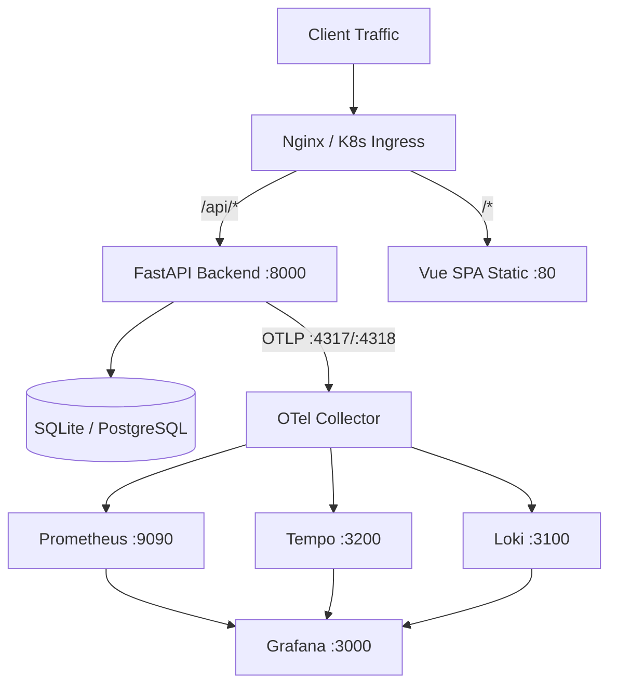

# Deployment & Operations

# Deployment & Operations

## Architecture Overview

Module manage containerization, environment orchestration, Kubernetes manifests, CI/CD deployment scripts, and observability stack.



---

## Local & Container Orchestration

Run with Docker Compose or Podman Compose. System detect engine automatically in `deploy.sh`.

### 1. Dev Mode (Core Services Only)
Start FastAPI and Vue frontend without monitoring stack:
```bash
podman-compose -f docker-compose.yml up -d --build
```
- Frontend mount: port `5173:80`
- Backend mount: port `8000:8000`
- Live code mount: `./backend/app -> /app/app`

### 2. Dev Mode (With Full Observability Stack)
Include `docker-compose.override.yml`:
```bash
podman-compose -f docker-compose.yml -f docker-compose.override.yml up -d --build
```

Stack components:
- `otel-collector` (`otel/opentelemetry-collector-contrib:0.90.1`): Receives traces/metrics/logs on ports `4317` (gRPC), `4318` (HTTP). Exposes metrics on `8889`, health on `13133`.
- `prometheus` (`prom/prometheus:v2.48.0`): Port `9090`. Config at `dockerdata/observability/prometheus/prometheus.yml`.
- `grafana` (`grafana/grafana:10.2.2`): Port `3000`. Postgres backend. Auto-provisions dashboards/datasources. Anonymous Admin enabled.
- `postgres` (`postgres:13`): Port `5432`. Backs Grafana database.
- `loki` (`grafana/loki:2.9.2`): Port `3100`. Log aggregation. Run as `user: "0"` for permission handling.
- `tempo` (`grafana/tempo:2.2.2`): Ports `3200` (UI/HTTP), `14268` (Jaeger gRPC), `9411` (Zipkin). Distributed tracing.
- `alertmanager` (`prom/alertmanager:v0.27.0`): Port `9093`. Prometheus alert routing.
- `nginx-exporter` (`nginx/nginx-prometheus-exporter:1.1.0`): Port `9113`. Scrapes `http://frontend/nginx_status`.

### 3. Production Compose Mode
Combine base with `docker-compose.prod.yml`:
```bash
podman-compose -f docker-compose.yml -f docker-compose.prod.yml up -d --build
```
- Sets `APP_ENV=prod`.
- Disables live source volume mounts. Persists DB and logs to `dockerdata/prod/`.
- Backend configures JSON logging with 10MB file rotation (`max-file: "3"`).

---

## Data Persistence & Directory Layout

All persistent state isolates inside `dockerdata/`:

```text
dockerdata/
├── dev/
│   ├── backend/
│   │   ├── data/          # Dev SQLite databases (app.db, dev.db)
│   │   └── logs/          # Dev logs (app.log, server.log)
│   └── frontend/
│       └── nginx/         # Dev Nginx reverse proxy configs
├── prod/
│   ├── backend/
│   │   ├── data/          # Prod databases
│   │   └── logs/          # Prod logs
│   └── frontend/
│       └── nginx/         # Prod Nginx configs
└── observability/         # Monitoring configurations & persistent storage
    ├── grafana/           # Dashboards, datasources, Postgres volume
    ├── loki/              # loki-config.yml, storage data
    ├── otel-collector/    # collector-config.yml
    ├── prometheus/        # prometheus.yml, alertmanager.yml, alerts.yml
    └── tempo/             # tempo-config.yml, storage data
```

---

## Backend Containerization Lifecycle

### Build (`backend/Dockerfile`)
1. Base image: `python:3.11-slim`.
2. Binary install: copies `uv` from `ghcr.io/astral-sh/uv:latest`.
3. Dependency install: executes `uv venv && uv pip install .`.
4. Doc build: executes `uv run mkdocs build --site-dir site`.
5. Exposes port `8000`.

### Container Startup (`backend/docker-entrypoint.sh`)
Runs automatically on container boot:
```bash
# 1. Apply database schema migrations
uv run alembic upgrade head

# 2. Run initial database seed/bootstrap
uv run python init_db.py

# 3. Exec passed command (defaults to uvicorn app.main:app --host 0.0.0.0 --port 8000)
exec uv run "$@"
```

### Local Dev Helper (`backend/Makefile`)
- `make install`: Sync uv dependencies.
- `make run`: Run Uvicorn server locally with hot-reload.
- `make test`: Run pytest suite.
- `make migrate`: Run `alembic upgrade head`.
- `make makemigrations message="..."`: Auto-generate Alembic revision.
- `make lint` / `make format`: Ruff checks and formatting.
- `make docs-serve`: Serve MkDocs locally.

---

## Kubernetes Deployment (GKE)

Production cluster deployment managed via Kubernetes manifests in `kubernetes/` and script `deploy-k8s.sh`.

### Manifest Specifications

#### `kubernetes/backend-deployment.yaml`
- Deployment: `backend`
- Strategy: `RollingUpdate` (`maxSurge: 25%`, `maxUnavailable: 0`)
- Port: `8000`
- Readiness probe: `HTTP GET /health` on port 8000 (`initialDelaySeconds: 5`, `periodSeconds: 5`)
- Service: ClusterIP on port `80` targeting container port `8000`.

#### `kubernetes/frontend-deployment.yaml`
- Deployment: `frontend`
- Strategy: `RollingUpdate` (`maxSurge: 25%`, `maxUnavailable: 0`)
- Port: `80`
- Service: `LoadBalancer` exposing port `80`.

#### `kubernetes/ingress.yaml`
GKE Ingress routes external traffic using `vue-python-demo-ip` static IP:
- Host routing: `your-domain.com` (replaced dynamically during deploy)
- `/api/*` -> backend service port `80`
- `/*` -> frontend service port `80`

### Automated Deployment Script (`deploy-k8s.sh`)
Deploys code directly to GKE.

**Usage:**
```bash
./deploy-k8s.sh <PROJECT_ID> <CLUSTER_NAME> <ZONE> <DOMAIN>
```

**Execution steps:**
1. Verifies local `gcloud`, `docker`, `kubectl` availability.
2. Configures GCP auth: `gcloud auth configure-docker --quiet`.
3. Sets cluster context: `gcloud container clusters get-credentials`.
4. Builds and pushes images:
   - Backend: `gcr.io/${PROJECT_ID}/vue-python-demo-backend:latest`
   - Frontend: `gcr.io/${PROJECT_ID}/vue-python-demo-frontend:latest`
5. Replaces domain placeholder in `kubernetes/ingress.yaml` using `sed`.
6. Applies manifests (`backend-deployment.yaml`, `frontend-deployment.yaml`, `ingress.yaml`).
7. Executes rollout validation via `scripts/verify-rollout.sh`.

---

## Operations & Verification Scripts

### Full CI/CD Local Test & Deploy (`deploy.sh`)
Automates pre-flight checks, testing, container build, and log output.
- Logs stdout/stderr to `todo/normal.<timestamp>.log` and `todo/error.<timestamp>.log`.
- Runs:
  1. Backend unit tests: `OTEL_COLLECTOR_ENDPOINT=localhost:4317 uv run python -m pytest -v`
  2. Frontend unit tests: `npm test`
  3. Frontend build check: `npm run build`
  4. OpenSpec registry checks: `openspec list`, `openspec view`
  5. Container teardown and forced rebuild with override configuration: `$COMPOSE_CMD -f docker-compose.yml -f docker-compose.override.yml up -d --build --force-recreate`
  6. Tails logs (50 lines) across backend, frontend, and all observability containers.

### Rollout Verification (`scripts/verify-rollout.sh`)
Used in CI/CD pipeline to confirm zero-downtime rolling upgrades.
```bash
./scripts/verify-rollout.sh <deployment_name>
```
1. Detects newest ReplicaSet by creation timestamp.
2. Waits for condition `Ready` with 120s timeout.
3. Checks all older ReplicaSets have active replicas scaled to `0`. Fails pipeline if stale pods persist.

### Security Audit (`scripts/security-tests.sh`)
Runs suite of security scanners:
- Secret leaks: `trufflehog filesystem . --fail`
- Python vulnerabilities: `pip-audit`
- Node dependencies: `npm audit --audit-level=high`
- Container images: `trivy image --severity HIGH,CRITICAL`
- Python AST security checks: `bandit -r backend/ -ll`

### Performance Testing (`scripts/performance-test.py`)
Locust load test suite. Tests root endpoint `GET /` and latency of prediction API `POST /predict`. Run with:
```bash
locust -f scripts/performance-test.py
```