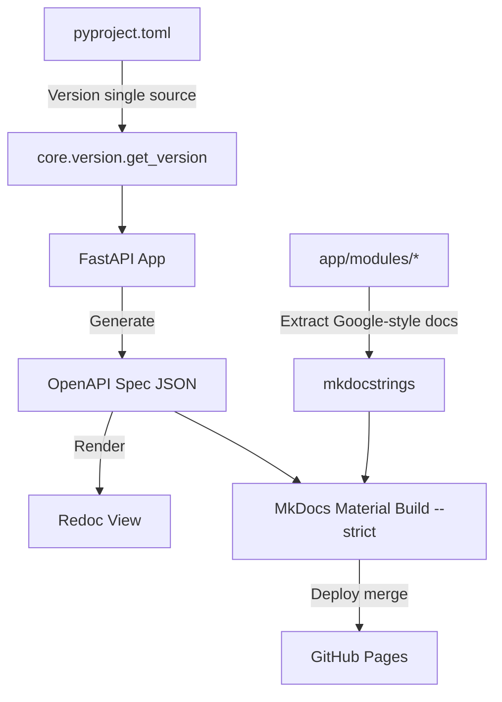

# Documentation & Specifications — backend-docs

# Documentation & Specifications — backend-docs

System auto-generates, validates, deploys backend API reference and module documentation.

## Architecture

MkDocs Material builds site from markdown docs, docstrings via `mkdocstrings`, and OpenAPI JSON spec.



## Key Components

- **Build Engine**: `mkdocs-material` + `mkdocstrings[python]` (Google-style docstring parsing).
- **API Spec Viewer**: Embedded Redoc rendering `openapi.json`.
- **Breaking Change Checker**: `oasdiff` compares PR spec against `master` baseline.
- **Coverage Checker**: `interrogate` enforces docstring coverage threshold on `app/modules/`.
- **Nav Generator**: `scripts/generate_nav.py` maps `app/modules/` directory to `mkdocs.yml` nav tree.
- **Update Automation**: `scripts/docs-update.sh` handles spec regen, strict build, changelog, and PR creation.

## Versioning Strategy

`backend/pyproject.toml` version field is single source of truth.

- `app.modules.core.version.get_version()` reads version at runtime for FastAPI/OpenAPI metadata.
- MkDocs tracks `master` continuously. No version tags for doc builds.
- Releases bump version via edit in `backend/pyproject.toml`.

## Local Operations

### Build and Serve Documentation
```bash
cd backend
PYTHONPATH=. uv run python scripts/update_openapi.py
uv run mkdocs build --strict
uv run mkdocs serve
```

### Auto-Update Navigation
Run after adding files to `docs/modules/` or modules to `app/modules/`:
```bash
cd backend
python scripts/generate_nav.py
```

### Automated Update Script
```bash
./scripts/docs-update.sh "description of changes"
```

### Check Docstring Coverage
Enforces Phase 1 limit (>= 35%). Excludes tests.
```bash
cd backend
uv run interrogate --fail-under 35 app/modules/admin app/modules/core app/modules/user app/modules/ai --exclude "*/tests/*"
```

### Check Version Sync
```bash
cd backend
uv run python -c "from app.modules.core.version import get_version; print('Version from pyproject.toml:', get_version())"
```

## CI/CD Pipeline

Defined in `.github/workflows/docs.yml`. Runs on PR to `master`:

1. Start fresh app server, fetch OpenAPI JSON.
2. Run `oasdiff` against `master` baseline. Block breaking changes without approval.
3. Run `interrogate` check on target modules (`admin`, `core`, `user`, `ai`).
4. Run `mkdocs build --strict`. Fails on broken links or unmapped docs.
5. Post summary of API diff to GitHub PR.
6. Merge to `master` triggers automatic deploy to GitHub Pages.

## Module Documentation Structure

Modular monolith docs map to `app/modules/` structure:

- `docs/modules/core/`: Shared utils, config, DB connections.
- `docs/modules/ai/`: LLM integrations, RAG pipelines, vector store.
- `docs/modules/user/`: User models, auth, RBAC.
- `docs/modules/admin/`: Admin endpoints, status reporting.
- `docs/modules/system/`: Health checks, system config.

## Review Standards

PR checklist for docs updates:

- Module `"""` docstring and public function docstrings present (Google style).
- Type hints present on all public methods.
- Docstring coverage passes minimum 35% threshold.
- `mkdocs build --strict` exits 0.
- Changelog entry added under `docs/changelog/`.
- PR label `api-breaking` applied if contract changes.

## Known Issues

- **OTEL Collector Unreachable (Port 4318)**: Build environment might fail connecting to local collector for trace data. Non-blocking; build continues without trace visualizations.