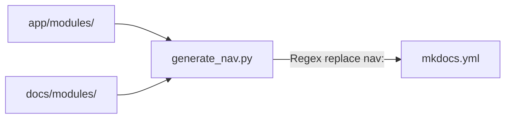

# Documentation & Specifications — backend-scripts

# Documentation & Specifications — backend-scripts

Script synchronizes `mkdocs.yml` navigation block with filesystem structure under `app/modules/` and markdown files under `docs/modules/`.



## Functions

### `generate_nav() -> str`
Scans filesystem, builds YAML navigation string.

- Iterates `app/modules/`. Ignores entries starting with `_`.
- For each directory, checks `docs/modules/<module_name>/`.
- Sorts found `.md` files. Converts `snake_case` filenames and directory names to Title Case.
- Constructs hardcoded core navigation entries:
  - `Home: index.md`
  - `Workflow: WORKFLOW.md`
  - `API Reference` (`api/index.md`, `api/openapi.md`)
  - `Internal Modules` overview (`modules/index.md`)
- Appends scanned module docs under `Internal Modules`.
- Returns YAML string block.

### `main() -> None`
Entry point. Updates configuration file in place.

1. Checks existence of `mkdocs.yml` in working directory. Exits if missing.
2. Reads `mkdocs.yml` content.
3. Locates `nav:` section using regex `^nav:.*?^(?=^[^ \n]|\Z)`.
4. Replaces matched section with output from `generate_nav()`.
5. Writes updated content back to `mkdocs.yml`.

## Filesystem Expectations

Script assumes execution from project root containing:

| Path | Description |
|---|---|
| `app/modules/<module>/` | Python backend modules |
| `docs/modules/<module>/*.md` | Markdown documentation per module |
| `mkdocs.yml` | MkDocs configuration file target |

## Usage

Run directly via Python CLI from repository root:

```bash
python3 backend/scripts/generate_nav.py
```