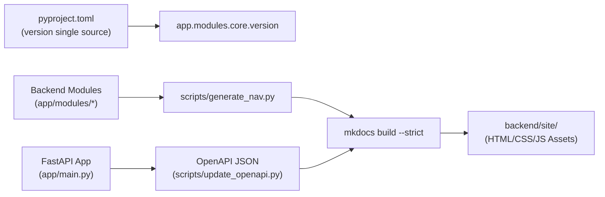

# Documentation & Specifications — backend-site

# Documentation & Specifications — backend-site

Static HTML site bundle generated by MkDocs Material (`mkdocs-1.6.1`, `mkdocs-material-9.7.7`) and `mkdocstrings`. Serves internal API reference, workflow guidelines, and Python module documentation for OmniSight backend.



## Structure & Generated Content

- `backend/site/index.html`: Entry page. System overview, build instructions, CI/CD integration.
- `backend/site/WORKFLOW/index.html`: Development workflow. Docstring policies, coverage thresholds, versioning strategy, CI validation rules.
- `backend/site/modules/index.html`: Python module directory overview.
- `backend/site/404.html`: Custom 404 handler configured for Material theme.
- `backend/site/assets/_mkdocstrings.css`: Custom formatting for Python API signatures, parameters, symbol badges (`attr`, `func`, `meth`, `class`, `mod`).
- `backend/site/assets/javascripts/lunr/tinyseg.js`: Japanese tokenizer module for Lunr client-side search indexing.

## Tooling & Dependencies

| Tool | Purpose | Configuration / Command |
|---|---|---|
| `mkdocs-material` | Static site generator & theme | `mkdocs.yml` (`features: navigation.tabs, navigation.sections, search.suggest`) |
| `mkdocstrings[python]` | Extracts Google/NumPy-style docstrings | Embedded in navigation via markdown pages |
| `interrogate` | Docstring coverage enforcement | Threshold $\ge 35\%$ (`--fail-under 35`) across `admin`, `core`, `user`, `ai` |
| `oasdiff` | OpenAPI breaking change detection | Baseline comparison against `master` |
| `scripts/generate_nav.py` | Auto-generates module navigation | Scans `app/modules/` |
| `scripts/update_openapi.py` | Exports OpenAPI schema from FastAPI | Run with `PYTHONPATH=.` |

## Versioning & Single Source of Truth

- Version defined in `backend/pyproject.toml` (`version = "x.y.z"`).
- FastAPI metadata reads version dynamically via `app.modules.core.version.get_version()`.
- Docs site does not maintain standalone version; tracks latest commit on `master` branch.
- Deployment fires automatically on merge to `master` (GitHub Pages).

## Build & Local Preview

```bash
cd backend

# 1. Update OpenAPI schema
PYTHONPATH=. uv run python scripts/update_openapi.py

# 2. Update navigation tree
python scripts/generate_nav.py

# 3. Check docstring coverage
uv run interrogate --fail-under 35 app/modules/admin app/modules/core app/modules/user app/modules/ai --exclude "*/tests/*"

# 4. Strict build and serve
uv run mkdocs build --strict
uv run mkdocs serve
```

## Known Operational Notes

- **OTEL Collector Warning**: Build pipeline handles unreachable OTEL Collector (`localhost:4318`) gracefully. Non-blocking; docs compile without active trace visualizer data.