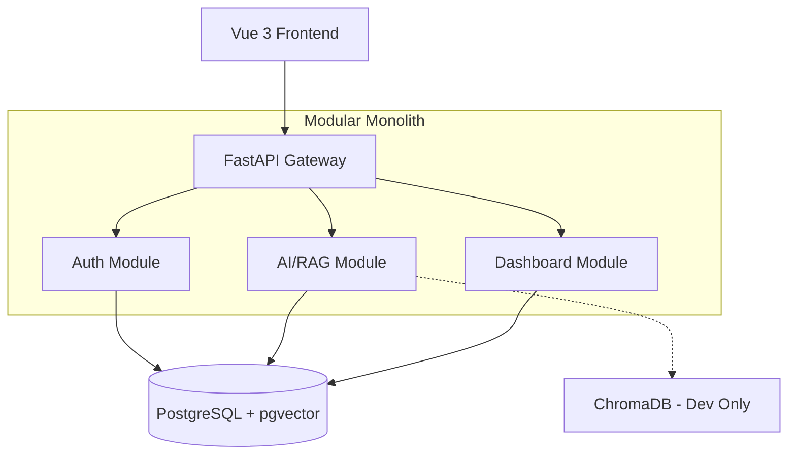

# Documentation & Specifications — docs-architecture-decisions

# Architecture Decision Records (ADR)

Module store design choices for RAG system. Use ADRs to track evolution, prevent regression, and onboard developers.

## Core Stack
- **Frontend**: Vue 3 (Composition API), Pinia, ECharts.
- **Backend**: FastAPI (Async), SQLAlchemy 2.0.
- **Infrastructure**: Docker, K8s (GKE), Prometheus/Grafana.

## Data & Vector Strategy
System use `VectorStore` abstraction to swap implementations based on environment.
- **Development**: ChromaDB. Local, file-based, zero infra requirements.
- **Production**: PGVector. ACID compliance, HNSW index, shared PostgreSQL infra.
- **Constraint**: Keep embedding dimension (384) and metadata schema identical across providers.

## System Pattern: Modular Monolith
Code split into `backend/app/modules/` (auth, ai, dashboard, system).
- **Boundary**: Logic isolated in code; shared database.
- **Communication**: Direct function calls. No network latency.
- **Benefit**: Simple deployment, transactional consistency, easy microservice migration path.

## Scaling & Performance
- **API**: Horizontal Pod Autoscaling (2-10 replicas) triggered at 70% CPU.
- **Database**: Read replicas for RAG retrieval. Connection pooling (size=10, overflow=20).
- **Search**: HNSW index (m=16, ef_construction=64) for sub-linear ANN search.
- **Limits**: Per-user token caps and global RPS limits protect LLM budget and DB stability.

## Architecture Overview

## Maintenance
1. **New Decisions**: Create `docs/architecture-decisions/NNNN-name.md`.
2. **Format**: Context, Decision, Rationale, Consequences.
3. **Review**: Architecture changes require PR approval from lead dev.

→ skipped: ADR versioning tool, add when team > 20.