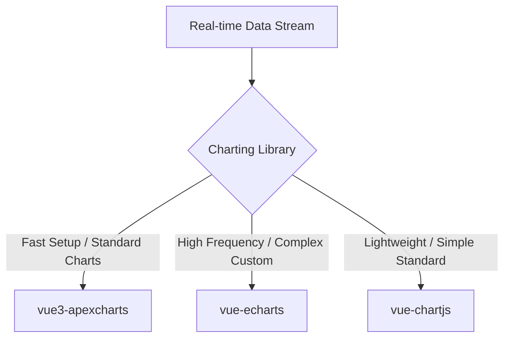

# Documentation & Specifications — docs-research

# Research: Vue 3 Charting Libraries for Real-time Visualization

## Purpose
Evaluation of charting libraries for Vue 3 real-time dashboard visualization. Measures Vue 3 Composition API support, TypeScript integration, real-time update performance, chart varieties, and bundle management.

## Evaluated Options

### 1. `vue3-apexcharts`
* **Target:** Rapid dashboard setup with standard modern charts.
* **Composition API:** Native `<script setup>` compatibility, uses reactive primitives.
* **TypeScript:** Full native support.
* **Real-time Performance:** Automatic reactive prop updates. Provides `appendData` API to append points without full-chart re-render.
* **Bundle Optimization:** Tree-shakeable.
* **Supported Types:** Line, Area, Bar, Pie, Donut, Scatter, Bubble, Heatmap, RadialBar, Candlestick.

### 2. `vue-echarts` (v8+)
* **Target:** High-frequency data feeds, complex data types (geographic, relational graphs).
* **Composition API:** Native `<script setup>`, `ref`, `provide` usage. Dropped Vue 2 support.
* **TypeScript:** Strong upstream Apache ECharts types.
* **Real-time Performance:** Smart diffing on `option` prop. Supports `manual-update` prop to bypass Vue reactivity overhead and invoke native `setOption`.
* **Bundle Optimization:** Dynamic import code generator for tree-shaking specific renderers/charts.
* **Supported Types:** Extensive. Standard 2D charts, 3D, GL, Graph, Heatmap, Treemap, Geo/Map.

### 3. `vue-chartjs` (Chart.js v4+)
* **Target:** Simple, lightweight standard charts with low overhead.
* **Composition API:** Functional wrapper over Canvas element.
* **TypeScript:** Standard definitions from Chart.js upstream.
* **Real-time Performance:** Automatic re-renders on `chartData` / `chartOptions` mutations.
* **Caveat:** Direct reactivity on props triggers "Target is readonly" warnings; requires deep cloning or unwrap before assignment.
* **Supported Types:** Line, Bar, Pie, Doughnut, Polar Area, Bubble, Radar, Scatter.

---

## Comparison Matrix

| Feature | `vue3-apexcharts` | `vue-echarts` | `vue-chartjs` |
| :--- | :--- | :--- | :--- |
| **Vue 3 API** | Native (`<script setup>`) | Native (v8+ pure Vue 3) | Wrapper component |
| **TS Types** | Full built-in | Strong (ECharts upstream) | Strong (Chart.js upstream) |
| **Real-time API** | `appendData` method | `manual-update` + `setOption` | Prop mutation / re-render |
| **Render Engine** | SVG / Canvas | Canvas / SVG | Canvas |
| **Complexity** | Low–Medium | Medium–High | Low |

---

## Selection Guide

* Use `vue-echarts` when update frequency exceeds 10Hz or when non-standard visualizations (e.g. topologies, heatmaps) needed.
* Use `vue3-apexcharts` for general-purpose metric dashboards needing out-of-the-box styling and `appendData` capability.
* Use `vue-chartjs` for lightweight apps needing basic charts with minimal bundle impact.