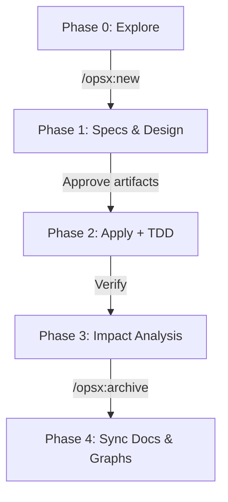

# Documentation & Specifications — docs

# Documentation & Specifications — docs

Directory contains developer operational manuals, agent-assisted workflows, testing recipes, and security audit records.

```
docs/
├── cypress-testing-guide.md   # E2E test setup, Cypress commands, examples
├── feature-dev-workflow.md    # AI-assisted feature engineering loop
└── security-analysis.md       # Dependency scan results and remediation steps
```

---

## 1. E2E Testing Guide (`docs/cypress-testing-guide.md`)

Instructions for Cypress frontend test execution.

### Structure
- Config: `frontend/cypress.config.ts` (sets `baseUrl: http://localhost:5173`)
- Spec root: `frontend/cypress/e2e/`
- Reference spec: `frontend/cypress/e2e/observability.cy.ts`

### Key Test Pattern
Validate DOM interactions and verify external telemetry sinks directly via HTTP requests:

```typescript
describe('Observability E2E', () => {
  it('sends metrics to the collector', () => {
    cy.visit('http://localhost:5173');
    cy.wait(2000);
    cy.request('http://localhost:8889/metrics').then((response) => {
      expect(response.status).to.eq(200);
      expect(response.body).to.include('document_load_duration_seconds');
    });
  });
});
```

### Execution Commands

Run inside `frontend/`:

```bash
# Interactive UI Runner
npx cypress open

# Headless run (CI target)
npx cypress run

# Specific spec execution
npx cypress run --spec "cypress/e2e/observability.cy.ts"
```

---

## 2. Feature Development Workflow (`docs/feature-dev-workflow.md`)

Multi-tool protocol combining specification engines, code graph indexers, and LLM coding skills.

### Tool Stack Responsibility Matrix

| Tool | Primary Scope | Core Actions |
|---|---|---|
| **OpenSpec** | Change lifecycle tracking | `/opsx:new`, `/opsx:ff`, `/opsx:apply`, `/opsx:verify`, `/opsx:archive` |
| **mattpocock/skills** | Alignment, TDD, reviews | `/grill-with-docs`, `/tdd`, `/code-review`, `/diagnosing-bugs` |
| **codebase-memory** | Token-efficient call graph search | `trace_path`, `detect_changes`, `review_change_impact` |
| **GitNexus** | Visual blast radius, architecture export | `gitnexus analyze`, `detect_impact`, `/gitnexus:generate_map` |
| **OpenWiki** | Persistent documentation | `openwiki --init`, `openwiki --update` |

### Standard Development Lifecycle



1. **Phase 0 (Exploration):** Use `/opsx:explore` and codebase-memory graph lookup. Output domain alignment to `CONTEXT.md` / ADR.
2. **Phase 1 (Specification):** Run `/opsx:new <feature>` or `/opsx:ff`. Human review required for `proposal.md`, `design.md`, `tasks.md`, `specs/` before implementation.
3. **Phase 2 (Implementation):** Run `/opsx:apply` with `/tdd` red-green-refactor loop. Check caller chains via `trace_path`.
4. **Phase 3 (Validation & Review):** Run `/opsx:verify`, compute blast radius with `review_change_impact` or `detect_impact`, run `/code-review`.
5. **Phase 4 (Archival & Sync):** Run `/opsx:archive`, re-index graph tools (`codebase-memory`, `gitnexus analyze`), run `openwiki --update`.

---

## 3. Security Analysis (`docs/security-analysis.md`)

Audit baseline recorded August 14, 2026.

### Vulnerability Log

| Package | Version | Severity | Impact | Remediation |
|---|---|---|---|---|
| `happy-dom` | ≤ 20.8.8 | Critical | VM Context Escape -> RCE | Run `npm audit fix --force` |
| `brace-expansion` | 2.0.0-2.1.3 | High | Unbounded expansion DoS | Run `npm audit fix` |
| `nanoid` | < 3.3.18 | High | Infinite loop on `size=0` DoS | Run `npm audit fix` |
| `@opentelemetry/core` | < 2.8.0 | Moderate | W3C Baggage memory allocation leak | Run `npm audit fix --force` |
| `esbuild` | ≤ 0.24.2 | Moderate | SSR request bypass | Run `npm audit fix --force` |
| `postcss` | ≤ 8.5.22 | Moderate | Arbitrary `.map` file read | Run `npm audit fix` |

### Tool Setup & Security Actions

```bash
# Missing scanner dependencies
pip install pip-audit bandit
npm install -g trufflehog trivy

# Remediation sequence
npm audit fix
npm audit fix --force # Verify breaking changes on happy-dom and @opentelemetry/core
```

---

## Integration with Codebase

- `docs/cypress-testing-guide.md` governs frontend test harness in `frontend/cypress/`.
- `docs/feature-dev-workflow.md` governs agent tool configuration in `CLAUDE.md` and `AGENTS.md`.
- `docs/security-analysis.md` tracks patches needed in `frontend/package.json` and backend Python requirements.