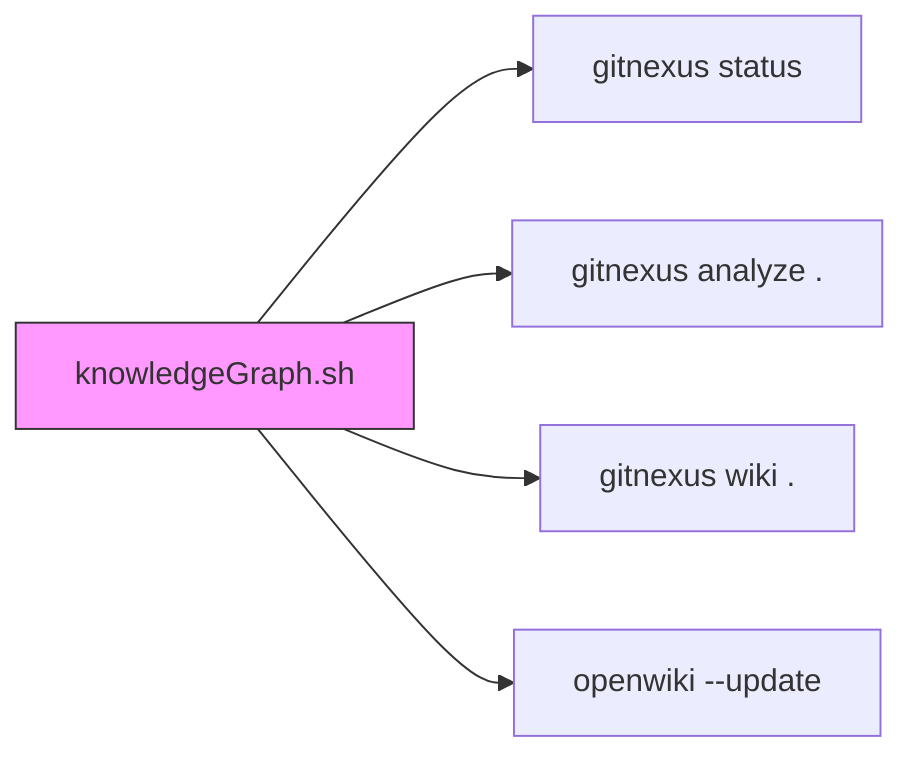

# Documentation & Specifications — knowledgeGraph.sh

# knowledgeGraph.sh

Generates repository knowledge graph via chained documentation tools.

## Purpose

Automates multi-step documentation pipeline: git analysis → wiki generation → wiki update. Single entry point for full doc refresh.

## Usage

```bash
./knowledgeGraph.sh
```

Runs from script directory (auto-detected via `realpath`).

## Pipeline Steps

| Step | Command | Output |
|------|---------|--------|
| 1 | `gitnexus status` | Repo health summary |
| 2 | `gitnexus analyze .` | Code structure analysis |
| 3 | `gitnexus wiki .` | Markdown wiki generation |
| 4 | `openwiki --update` | Wiki index refresh |

Step 5 (`openwiki` with prompt) commented out — manual trigger for AI doc generation.

## Dependencies

- `gitnexus` — CLI for git repo analysis and wiki gen
- `openwiki` — Wiki builder/indexer
- Both must be in `PATH`

## Execution Flow



## Integration

Called manually or via CI. No incoming calls. No internal functions. Pure orchestration script.

## Customization

Edit script to:
- Add/remove pipeline steps
- Change `PROJECT_ROOT` logic
- Uncomment AI doc generation step
- Add flags for selective execution

## Failure Modes

- Missing `gitnexus`/`openwiki` → command not found
- Non-git directory → `gitnexus` errors
- Permission denied on wiki output dir → `openwiki` fails

Each step runs independently; later steps execute even if prior fail. Add `set -e` or `&&` chaining for strict failure handling.