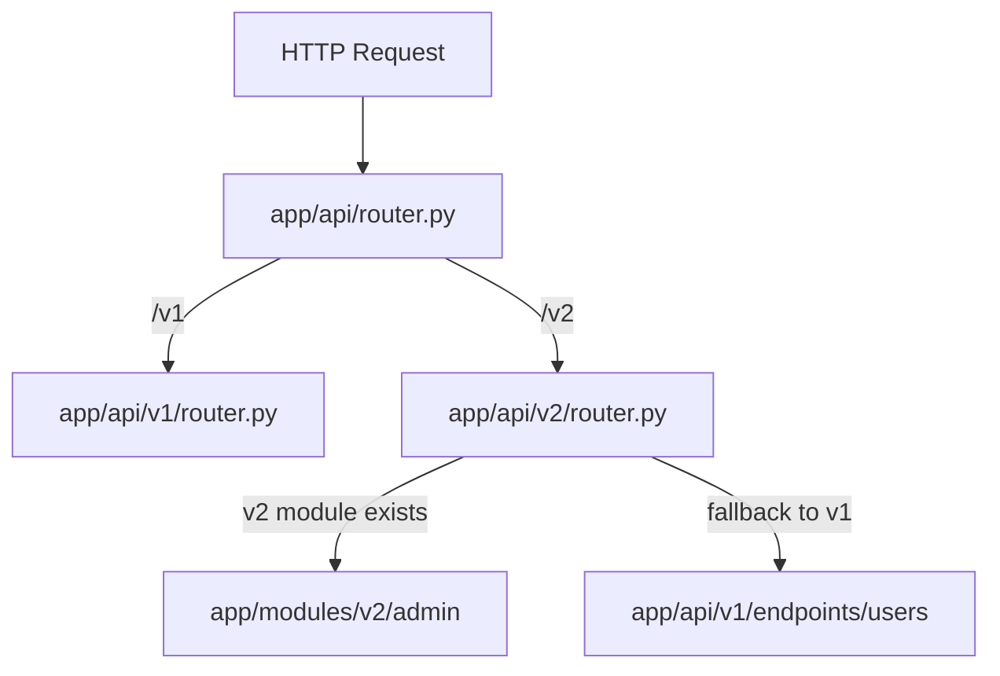

# Documentation & Specifications — openspec-design

# API Versioning and Fallback Specification

Design specification for FastAPI multi-version routing (v1/v2) with explicit delegation fallback.

## Architectural Design

Uses explicit Router Delegation pattern over dynamic middleware rewrite. Maintains static type safety, OpenAPI schema accuracy, testability.



## Directory Structure

```text
app/api/
├── v1/
│   └── router.py
├── v2/
│   └── router.py
└── router.py
```

- `app/api/router.py`: Root API dispatcher. Mounts `/v1` and `/v2` prefixes.
- `app/api/v1/router.py`: Aggregates baseline v1 endpoints.
- `app/api/v2/router.py`: Aggregates v2 implementations; delegates missing modules to v1 endpoints.
- `app/modules/v2/`: New v2 feature logic isolated here.

## Implementation Pattern

In `app/api/v2/router.py`, register native v2 modules. Bind missing v2 endpoints to v1 router instances:

```python
from fastapi import APIRouter
from app.modules.v2.admin import router as admin_v2
from app.api.v1.endpoints import users as users_v1

v2_router = APIRouter()

# Native v2 module
v2_router.include_router(admin_v2, prefix="/admin")

# Fallback: /api/v2/users serves v1 implementation
v2_router.include_router(users_v1, prefix="/users")
```

## Strategy Trade-offs

| Strategy | Pros | Cons |
| :--- | :--- | :--- |
| **Router Delegation** (Selected) | Type-safe, OpenAPI doc accuracy, clear routing boundaries, easy unit tests | Manual fallback list maintenance in `v2/router.py` |
| **Middleware Rewrite** | Automatic fallback without code changes | Breaks request context, obscures route tracing, bypasses schema generation |