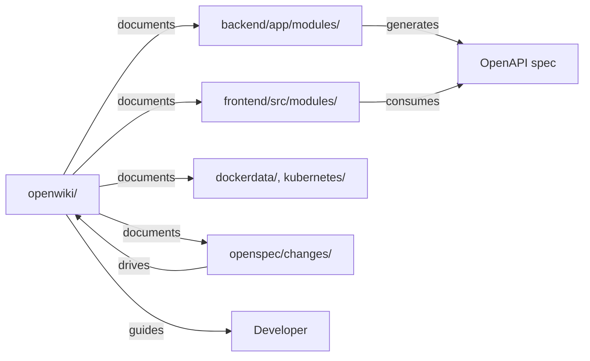

# Documentation & Specifications — openwiki

# openwiki — Code Wiki

Engineering documentation for the Omnisight Platform. Markdown files in `openwiki/` serve as the canonical reference for architecture, APIs, data design, observability, quality practices, and operations.

## Purpose

Single source of truth for engineers working on this repo. Covers:
- System architecture & design decisions
- API design & versioning strategy
- Database schema, optimization, migrations
- AI/RAG pipeline internals
- Observability stack (metrics, traces, logs)
- Testing strategy & CI/CD quality gates
- Development workflow (OpenSpec change management)
- Deployment & operations

## Structure

```
openwiki/
├── INSTRUCTIONS.md              # Wiki maintenance guidelines
├── index.md                     # Navigation hub
├── architecture-deep-dive.md    # System architecture, modular monolith, decisions
├── api-design-principles.md     # REST, versioning, auth, error handling
├── ai-rag-orchestration.md      # RAG pipeline, vector search, LLM integration
├── data-system-design.md        # PostgreSQL schema, indexes, connection pooling
├── backend-service.md           # FastAPI app structure, modules, testing
├── frontend-app.md              # Vue 3 + Vuetify + Vite + Pinia
├── observability.md             # OpenTelemetry, Prometheus, Loki, Tempo, Grafana
├── quality-engineering-qa.md    # Test layers, coverage gates, static analysis
├── devops-deployment.md         # Docker, K8s, Helm, CI/CD
├── development-workflow-performance.md  # OpenSpec, git workflow, metrics
├── docker-orchestration.md      # Docker Compose for local dev
├── quickstart.md                # One-command startup, local dev steps
└── rag/
    └── overview.md              # RAG pipeline component detail
```

## Key Documents Map

| Need | Read |
|------|------|
| Start developing | `quickstart.md` |
| Understand system shape | `architecture-deep-dive.md` |
| Design/change an API | `api-design-principles.md` |
| Debug DB performance | `data-system-design.md` |
| Add AI feature | `ai-rag-orchestration.md` + `rag/overview.md` |
| Instrument code | `observability.md` |
| Write tests | `quality-engineering-qa.md` |
| Deploy to prod | `devops-deployment.md` |
| Propose a change | `development-workflow-performance.md` |

## Maintenance Rules (from INSTRUCTIONS.md)

- Ground pages in actual repo structure and recent code changes
- Prefer practical navigation over generic summaries
- Inspect git history for design rationale
- Keep quickstart, architecture, source map, workflows, domain concepts, operations, testing, integration points current
- Update when code changes invalidate docs

## Integration Points

- **OpenSpec workflow** (`.agent/workflows/`) drives change proposals → specs → implementation → archive; wiki reflects approved changes
- **Backend modules** (`backend/app/modules/`) map to `backend-service.md` module descriptions
- **Frontend modules** (`frontend/src/modules/`) map to `frontend-app.md`
- **Observability configs** (`dockerdata/observability/`) map to `observability.md` dashboards
- **Database migrations** (`backend/alembic/`) map to `data-system-design.md`
- **K8s manifests** (`kubernetes/`) map to `devops-deployment.md`

## Updating the Wiki

1. Edit relevant `.md` file in `openwiki/`
2. Cross-link from `index.md` if new page
3. Verify links resolve (relative paths)
4. Commit with descriptive message: `docs: update <topic> - <reason>`

## Diagram: Wiki ↔ Codebase



## Quick Reference Commands

```bash
# View wiki index
cat openwiki/index.md

# Search across wiki
grep -r "vector" openwiki/

# Validate links (requires markdown-link-check)
npx markdown-link-check openwiki/*.md

# Open in browser (if serving)
# python -m http.server -d openwiki 8080
```

## Conventions

- **File naming**: kebab-case, descriptive (`api-design-principles.md`)
- **Front matter**: YAML with `type`, `title`, `description`, `tags` (see existing files)
- **Mermaid**: Use sparingly (5-10 nodes max) for architecture/flow clarity
- **Code blocks**: Annotate language; keep snippets minimal and real
- **Cross-refs**: Relative links (`../backend-service.md#api-versioning`)

## When to Update

| Trigger | Action |
|---------|--------|
| New module added | Add to `backend-service.md` or `frontend-app.md` module list |
| API version added | Update `api-design-principles.md` versioning table |
| DB index added | Document in `data-system-design.md` optimization section |
| New observability dashboard | Add to `observability.md` Grafana dashboards list |
| Change proposal archived | Reflect outcome in relevant wiki page |
| SLO target changed | Update `observability.md` and `quality-engineering-qa.md` tables |