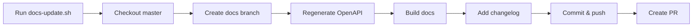

# Documentation & Specifications — scripts

`docs-update.sh` updates API docs and changelog in one atomic flow.

### Purpose  
Automates documentation sync: regenerates OpenAPI spec, validates MkDocs build, logs changes, opens PR.  

### How it works  
1. Requires change description as argument  
2. Checks out `master`, pulls latest  
3. Creates branch `docs/update-<timestamp>`  
4. Runs `update_openapi.py` in `backend/` to regenerate OpenAPI spec  
5. Runs `mkdocs build --strict` to validate docs  
6. Appends changelog entry to `docs/changelog/updates.md`  
7. Commits all changes with `docs: <description>`  
8. Pushes branch and creates GitHub PR  

### Key components  
- `update_openapi.py`: Generates OpenAPI spec from backend code (assumed to exist)  
- `mkdocs`: Static site generator for docs (must be installed via `uv`)  
- `gh`: GitHub CLI (must be installed and authenticated)  

### Integration  
- Depends on `backend/` structure and `update_openapi.py` output  
- Output: `docs/` directory updated, PR opened in GitHub  
- No inbound calls — triggered manually or via CI  

### Requirements  
- `git`, `uv`, `gh` installed  
- GitHub token configured for `gh`  
- `update_openapi.py` must exist and write to `docs/openapi.yaml`  

→ skipped: auto-merge, CI trigger  
add when: team requires zero-touch deploys