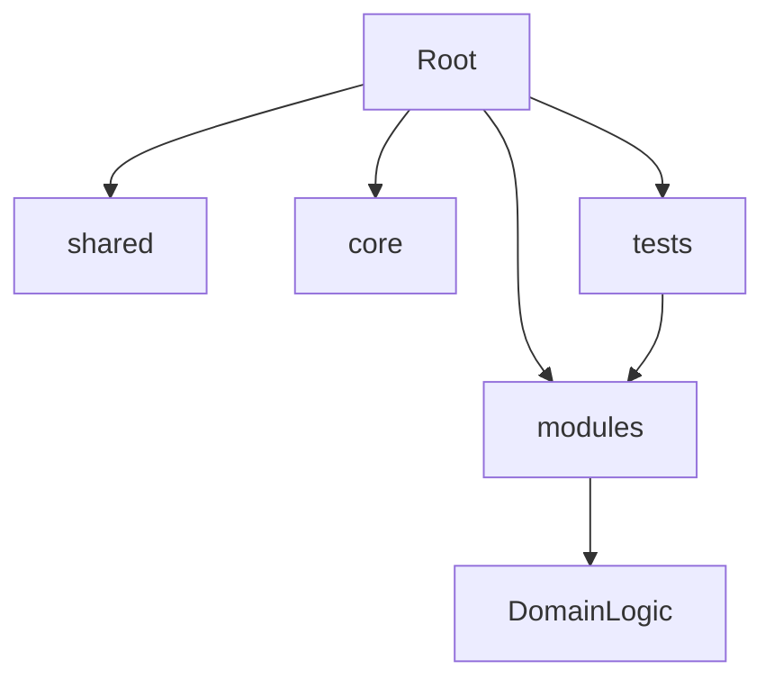

# Documentation & Specifications — specs-architecture

# Project Architecture Specification

Standardize code organization. Prevent dependency rot.

## Directory Structure

- `modules/`: Domain logic (admin, user, dashboard).
- `shared/`: Common code. Use only if 3+ modules consume.
- `core/`: Backend foundation. Security, DB, global config.
- `tests/`: Mirror module structure.

## Testing Alignment

- Frontend: `modules/<module-name>/__tests__/`.
- Backend: `tests/modules/<module-name>/`.
- Global utils: `tests/` root.
- No flat root `tests/` directory for module logic.

## Import Strategy

- Cross-module relative paths forbidden.
- Use aliases: `@/modules/<name>/...`.
- Maintain strict module boundaries.

→ skipped: automated lint enforcement, add when circular dependencies occur.