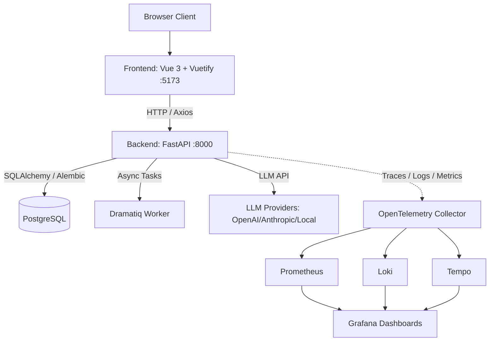

# Documentation & Specifications — todo

# Documentation & Specifications — Todo Module

Documentation and technical specification for full-stack application architecture (Vue 3/Vuetify frontend, FastAPI backend, PostgreSQL, Dramatiq workers, OpenTelemetry monitoring).

## Architecture Overview



Domain-driven design and Modular TDD structure applied across `backend/app/modules/` and `frontend/src/modules/`.

---

## Directory Layout

```
.
├── backend/
│   ├── alembic/              # Migration scripts
│   ├── app/
│   │   ├── api/v1/           # Versioned API routes
│   │   ├── core/             # DB, config, security setup
│   │   ├── modules/          # Feature domains (ai, auth, system)
│   │   └── main.py           # FastAPI entrypoint
│   ├── pyproject.toml        # Dependencies (uv lockfile)
│   └── tests/                # Pytest suites
├── frontend/
│   ├── src/
│   │   ├── layouts/          # Layout wrapper components
│   │   ├── modules/          # Domain components & routes
│   │   ├── stores/           # Pinia state modules
│   │   ├── composables/      # useApi and shared composables
│   │   └── views/            # Route pages
│   ├── package.json          # Node dependencies
│   └── tsconfig.json         # TypeScript config
├── docker-compose.yml        # Multi-service setup
└── .env.example              # Env var template
```

---

## Backend Implementation

FastAPI handles routing, dependency injection, and data persistence via SQLAlchemy ORM.

### Key Components
- `app/core/config.py`: Pydantic Settings reads from `.env`.
- `app/core/database.py`: Session factory and engine management. FastAPI route dependency injection provides sessions.
- `app/core/security.py`: JWT token generation and validation.
- `entrypoint.sh`: Runs `alembic upgrade head` on container startup before booting Uvicorn.

### Local Run Commands

```bash
cd backend
uv sync
uv run uvicorn app.main:app --reload
```

Generate Alembic migrations:
```bash
docker compose exec backend uv run alembic revision --autogenerate -m "Migration description"
```

---

## Frontend Implementation

Vue 3 using Composition API, TypeScript, Vuetify components, and Pinia stores.

### Layout Wrapper Rule
`App.vue` must not contain direct layout UI elements. Must wrap views inside layout components:

```vue
<template>
  <DefaultLayout />
</template>

<script setup lang="ts">
import DefaultLayout from '@/modules/layouts/DefaultLayout.vue'
</script>
```

*Note:* Pre-commit hook enforces layout usage in `App.vue`.

### Core Services
- `src/composables/useApi.ts`: Axios client handling base URLs, authentication tokens, and request/response interceptors.
- `src/stores/auth.ts`: User session state.
- `src/stores/theme.ts`: UI theme persistence (dark/light).

### Local Run Commands

```bash
cd frontend
npm install
npm run dev
```

---

## API Specification

Endpoints prefixed with `/api/v1`. OpenAPI docs served at `/docs`.

| Method | Path | Description |
|---|---|---|
| `GET` | `/health` | Legacy health check |
| `GET` | `/api/v1/health` | Service health status |
| `POST` | `/api/v1/auth/register` | Register user account |
| `POST` | `/api/v1/auth/login` | Authenticate user and issue JWT cookie |
| `GET` | `/api/v1/users/me` | Fetch active user profile |
| `GET` | `/api/v1/users` | List mock user records |
| `GET` | `/api/v1/dashboard/stats` | Return system metrics (user count, active sessions, API calls) |

---

## Observability Infrastructure

Monitored via OpenTelemetry SDK integration.

- **OpenTelemetry Collector**: Ingests traces, metrics, logs.
- **Prometheus**: Scrapes time-series metrics.
- **Loki**: Ingests structured logs enriched with `trace_id`.
- **Tempo**: Stores distributed traces.
- **Grafana**: Pre-configured dashboards for backend latency, error rates, frontend component render times.

---

## Testing & Containerization

### Test Execution

Run backend tests:
```bash
cd backend && uv run pytest
```

Run frontend unit tests:
```bash
cd frontend && npm run test
```

### Docker / Podman Orchestration

```bash
cp .env.example .env

# Docker
docker compose up

# Podman
podman compose up
```

Exposed default ports:
- Frontend: `5173`
- Backend: `8000`