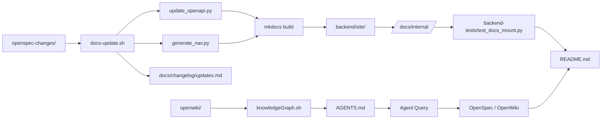

# Documentation & Specifications

Documentation & Specifications — Core

`README.md` is the single source of truth. All other docs serve it.

`AGENTS.md` enforces tool order: `codebase-memory` → `GitNexus` → `OpenWiki` → `OpenSpec`. No raw grep. No guesswork.

`AGENTS.sample.md` templates agent configs. Standardizes stack, commands, conventions. Used by `docs-agents` and `openspec`.

`openspec/` drives spec-first development. `config.yaml` defines schema. `openspec-changes/` tracks each change as dated dir with `design.md`, `proposal.md`, `specs/`, `tasks.md`. `openspec-specs` aggregates Gherkin-style requirements across backend, frontend, infra.

`openwiki/` is the canonical wiki. `index.md` maps architecture, APIs, RAG, observability. `INSTRUCTIONS.md` governs updates. `knowledgeGraph.sh` auto-generates wiki from `gitnexus` + `openwiki --update`.

`backend-docs` and `backend-site` build static API docs. `mkdocs.yml` + `mkdocstrings` extract Google-style docstrings from `app/modules/`. `generate_nav.py` syncs filesystem to `nav:` in `mkdocs.yml`. `update_openapi.py` generates OpenAPI JSON from FastAPI app.

`backend-tests` validates `/docs/internal/` endpoint serves built HTML. `client` fixture hits `/docs/internal/` → asserts 200 + `text/html`.

`docs/` holds operational guides: `cypress-testing-guide.md`, `feature-dev-workflow.md`, `security-analysis.md`.

`docs-research` evaluates Vue charting libs: `vue3-apexcharts`, `vue-echarts`, `vue-chartjs`.

`docs-architecture-decisions` stores ADRs: ChromaDB vs PGVector, modular monolith, embedding consistency.

`docs-changelog` tracks changes: `updates.md` index + dated `.md` files per change.

`prompts.md` lists feature proposals. Acts as roadmap + execution checklist.

`scripts/docs-update.sh` atomic doc pipeline: regenerate OpenAPI → build MkDocs → log change → open PR.

`specs-architecture` enforces module boundaries: `modules/`, `core/`, `shared/`, `tests/` mirror. No cross-module relative imports. Aliases only: `@/modules/<name>`.

`todo` diagrams full-stack: Vue → FastAPI → PostgreSQL → Dramatiq → LLM → OpenTelemetry → Grafana.

All docs are static. No runtime. No execution. Only generation, validation, and reference.

`knowledgeGraph.sh` → `gitnexus` → `openwiki` → `mkdocs` → `docs-update.sh` → `openspec-changes/` → `README.md`

One flow: Change → Spec → Code → Doc → Validate → PR.

