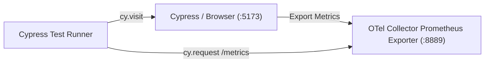

# Observability & Tracing — cypress

# Observability E2E Test

`frontend/cypress/e2e/observability.cy.ts`

Verifies frontend OpenTelemetry metrics export pipeline. Confirms browser metrics reach OpenTelemetry Collector Prometheus endpoint.

## Architecture Flow



## Test Specification

Suite: `Observability E2E`
Test case: `sends metrics to the collector`

### Execution Steps

1. **Visit Frontend**: Calls `cy.visit('http://localhost:5173')`. Triggers page load and frontend OpenTelemetry auto-instrumentation.
2. **Wait for Export**: Calls `cy.wait(2000)`. Gives OTel SDK time to flush metrics batch to collector.
3. **Query Metrics Endpoint**: Calls `cy.request('http://localhost:8889/metrics')` on OTel Collector Prometheus scrape target.
4. **Assertions**:
   - `expect(response.status).to.eq(200)`: Collector Prometheus endpoint reachable.
   - `expect(response.body).to.include('document_load_duration_seconds')`: Confirms browser document load duration metric present.

## Environment Requirements

- Frontend dev server running on `http://localhost:5173`.
- OpenTelemetry Collector running with Prometheus exporter active on `http://localhost:8889`.
- Frontend OTel SDK configured to push web vitals/document load metrics to collector receiver.

## Run Test

```bash
npx cypress run --spec "cypress/e2e/observability.cy.ts"
```