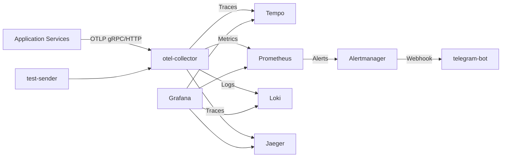

# Observability & Tracing — docker-compose.observability.yml

# Observability Stack — docker-compose.observability.yml

## Purpose

Local development observability stack. Collects traces, metrics, logs from services via OpenTelemetry Collector. Stores in Tempo (traces), Prometheus (metrics), Loki (logs). Visualizes in Grafana. Jaeger provides alternate trace UI. Alertmanager routes alerts; telegram-bot placeholder for notifications.

## Architecture



## Services

| Service | Image | Ports | Role |
|---------|-------|-------|------|
| **otel-collector** | `otel/opentelemetry-collector-contrib:0.90.1` | 4317 (gRPC), 4318 (HTTP), 8889 (Prometheus) | Receives OTLP, exports to all backends |
| **prometheus** | `prom/prometheus:v2.48.0` | 9090 | Metrics storage, scraping, alerting |
| **alertmanager** | `prom/alertmanager:v0.27.0` | 9093 | Alert routing, deduplication |
| **telegram-bot** | `alpine:latest` | — | Placeholder; replace with real bot image |
| **grafana** | `grafana/grafana:10.2.2` | 3000 | Dashboards, datasources pre-provisioned |
| **jaeger** | `jaegertracing/all-in-one:latest` | 16686, 14268, 14250 | Trace UI, receives from Tempo |
| **loki** | `grafana/loki:2.9.2` | 3100 | Log aggregation |
| **tempo** | `grafana/tempo:2.2.2` | 3200, 14268, 14250, 9411 | Trace storage, Jaeger/Zipkin compatible |
| **test-sender** | `alpine/curl` | — | Sends test traces/metrics/logs to collector |

## Data Flow

1. **Applications** send OTLP to `otel-collector:4317` (gRPC) or `:4318` (HTTP)
2. **Collector** processes via `collector-config.yml` (see below), forwards:
   - Traces → Tempo (OTLP), Jaeger (gRPC/Thrift)
   - Metrics → Prometheus (remote write), self-scraped on `:8889`
   - Logs → Loki (OTLP)
3. **Prometheus** scrapes collector metrics, evaluates rules, fires alerts to Alertmanager
4. **Alertmanager** routes to telegram-bot webhook (placeholder)
5. **Grafana** queries all backends via provisioned datasources
6. **test-sender** runs once on startup, validates pipeline

## Configuration Files (mounted)

```
dockerdata/observability/
├── otel-collector/
│   ├── collector-config.yml      # Receivers, processors, exporters
│   └── test-sender.sh            # Generates sample telemetry
├── prometheus/
│   ├── prometheus.yml            # Scrape configs, remote write
│   └── alertmanager.yml          # Alert routes, receivers
├── grafana/
│   ├── provisioning/datasources/ # Tempo, Prometheus, Loki, Jaeger
│   └── provisioning/dashboards/  # Pre-built dashboards
├── loki/
│   └── loki-config.yml           # Storage, limits
└── tempo/
    └── tempo-config.yml          # Storage, receivers, compaction
```

## Collector Config (key points)

`collector-config.yml` defines:
- **Receivers**: `otlp` (grpc/http), `prometheus` (self-metrics)
- **Processors**: `batch`, `memory_limiter`, `resource` (adds service.name)
- **Exporters**: `otlp/tempo`, `otlp/jaeger`, `prometheus`, `loki`
- **Pipelines**: traces → tempo+jaeger, metrics → prometheus, logs → loki

## Startup

```bash
docker compose -f docker-compose.observability.yml up -d
```

- Grafana: http://localhost:3000 (anonymous admin)
- Prometheus: http://localhost:9090
- Jaeger: http://localhost:16686
- Tempo: http://localhost:3200
- Alertmanager: http://localhost:9093

## Integration with Application Code

Applications must configure OpenTelemetry SDK to export to `http://otel-collector:4318` (HTTP) or `otel-collector:4317` (gRPC). Example (Python):

```python
from opentelemetry.exporter.otlp.proto.http.trace_exporter import OTLPSpanExporter
exporter = OTLPSpanExporter(endpoint="http://otel-collector:4318/v1/traces")
```

Set `OTEL_SERVICE_NAME` per service for trace correlation.

## Volumes

- `grafana_data` — named volume for Grafana DB (dashboards, users)
- All other data bind-mounted under `./dockerdata/observability/` for persistence and config editing

## Notes

- `telegram-bot` is a stub. Replace with `ghcr.io/yourorg/telegram-alert-bot` or similar that accepts POST at `/alert`
- `loki` runs as `user: "0"` for Podman/SELinux compatibility
- `tempo` uses local filesystem storage (`/tmp/tempo`); not production-grade
- `test-sender` exits after one run; check logs to verify pipeline: `docker compose -f docker-compose.observability.yml logs test-sender`

## Extending

- Add scrape targets in `prometheus.yml` for custom metrics
- Add alert rules in `prometheus.yml` → `rule_files`
- Add Grafana dashboards to `provisioning/dashboards/` (auto-loaded)
- For production: enable TLS, authentication, object storage backends (S3/GCS) for Tempo/Loki