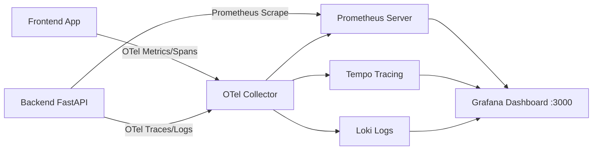

# Observability & Tracing — docs

# Observability & Tracing Docs

Documentation and metric reference samples for backend (FastAPI/CPython) and frontend OpenTelemetry + Prometheus observability pipeline.

## Pipeline Architecture



---

## Metric Reference

### Backend Metrics (`job="backend-service"`)

Generated by `prometheus-fastapi-instrumentator` and OpenTelemetry Python SDK (`1.44.0`, CPython 3.11).

| Metric | Type | Description | Key Labels |
|---|---|---|---|
| `http_server_duration_milliseconds` | Histogram | Request latency in ms | `http_method`, `http_status_code`, `http_target`, `http_server_name` |
| `http_server_active_requests` | Gauge | Currently in-flight HTTP requests | `http_method`, `http_server_name` |
| `http_server_request_size_bytes` | Histogram | Compressed incoming request body size | `http_method`, `http_target` |
| `http_server_response_size_bytes` | Histogram | Compressed outgoing response body size | `http_method`, `http_target` |
| `http_requests_total` | Counter | Legacy request counter | `handler`, `method`, `status` |
| `http_request_duration_highr_seconds` | Histogram | High-resolution duration without route labels | `le` |
| `process_cpu_seconds_total` | Counter | Total CPU spent in user/system space | None |
| `process_resident_memory_bytes` | Gauge | Resident memory size (RSS) in bytes | None |
| `python_gc_collections_total` | Counter | GC runs per generation | `generation="0\|1\|2"` |
| `target_info` | Gauge | Telemetry target metadata | `service_version`, `telemetry_sdk_version` |

### Frontend Metrics (`job="frontend-app"`)

Generated by `@opentelemetry/instrumentation-document-load` and `@opentelemetry/instrumentation-user-interaction`.

| Metric | Type | Description | Key Labels |
|---|---|---|---|
| `frontend_app_page_view_total` | Counter | Total route views | `route_name`, `route_path` |
| `frontend_app_button_click_total` | Counter | Button interaction events | `element_id`, `element_type`, `page_route` |
| `frontend_app_form_submit_total` | Counter | Submitted forms count | `form_name`, `page_route` |
| `frontend_app_component_render_duration_milliseconds` | Histogram | Component mount/render latency | `component_name`, `route_path` |
| `http_client_duration_milliseconds` | Histogram | Outbound API client duration | `http_method`, `http_status_code`, `http_url` |

---

## Alert Rules Reference

Defined in `alerts.yml`:

```yaml
# Backend Alerts
- alert: HighBackendLatency
  expr: histogram_quantile(0.95, sum(rate(http_server_duration_milliseconds_bucket{job="backend-service"}[5m])) by (le, job)) > 200
  for: 2m

- alert: TooManyActiveBackendRequests
  expr: sum(http_server_active_requests{job="backend-service"}) > 50
  for: 5m

- alert: HighErrorRate
  expr: rate(http_server_duration_milliseconds_count{status=~"5.."}[5m]) > 0.05
  for: 1m

- alert: ServiceDown
  expr: up == 0
  for: 1m

# Frontend Alerts
- alert: SlowComponentRender
  expr: histogram_quantile(0.95, sum(rate(frontend_app_component_render_duration_milliseconds_bucket[5m])) by (le, component_name)) > 500
  for: 5m

- alert: PageViewDrop
  expr: increase(frontend_app_page_view_total{job="frontend-app"}[10m]) < 1

- alert: HighFrontendClientLatency
  expr: histogram_quantile(0.95, sum(rate(http_client_duration_milliseconds_bucket{job="frontend-app"}[5m])) by (le, http_url)) > 1000
  for: 2m

- alert: NoLoginButtonClicks
  expr: increase(frontend_app_button_click_total{element_id="login-submit"}[15m]) == 0
  for: 15m
```

---

## Custom Metric Instrumentation

Follow OpenTelemetry semantic naming: `{domain}_{action}_{unit}`.

### Python Backend Example

```python
from opentelemetry import metrics

meter = metrics.get_meter("myapp")
order_counter = meter.create_counter("order_created_total")
order_counter.add(1, {"status": "success", "payment_method": "credit_card"})
```

---

## Verification & Troubleshooting

### Stack Boot

```bash
docker-compose -f docker-compose.yml -f docker-compose.override.yml up -d
```

### Dashboard Access

- **Location**: `http://localhost:3000`
- **Auth**: `admin` / `admin`

### Dashboards

1. **System Overview**: Cluster health, CPU, memory (`process_resident_memory_bytes`), disk.
2. **FastAPI Metrics**: Request rate (`http_server_duration_milliseconds_count`), p50/p95/p99 latency, error rates.
3. **OpenTelemetry Collector**: Export throughput for spans/metrics/logs.
4. **Tempo Traces**: Trace waterfall views.
5. **Loki Logs**: Query via `{service="backend"}` or `{service="frontend"}`.

### Debugging Steps

1. No data in Prometheus: Check `/metrics` endpoint returns `200` and target state `UP`.
2. Missing Traces: Check OTel exporter endpoint connection to Tempo datasource on collector port `4317`/`4318`.
3. Missing Logs: Check Loki log shipper container and service label tags.