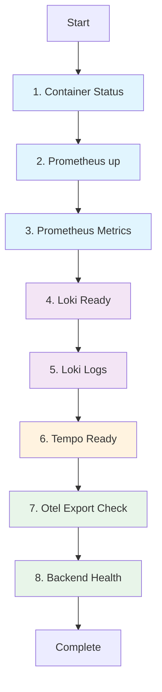

# Observability & Tracing — observability.check.sh

# Observability Stack Health Check Script

## Purpose

`observability.check.sh` validates the entire observability stack (Prometheus, Loki, Tempo, Otel-Collector, Backend) is running and correctly exporting/receiving metrics, logs, and traces. Runs as a standalone verification script after stack deployment.

## How It Works

Script executes sequential health checks against local endpoints. Each check:
1. Queries a specific HTTP endpoint or Docker status
2. Validates expected response pattern
3. On failure: prints colored error, shows recent error logs via `show_service_logs()`
4. Continues to next check (non-blocking)

All checks target `localhost` ports — assumes stack runs via `podman-compose` on host network.

## Key Components

### `show_service_logs(service, lines=50)`
Helper that fetches recent logs for a failed service, filters for error-level keywords (`error|fail|exception|panic|fatal|critical|warning`), displays first 20 matches.

### Check Sequence

| # | Check | Target | Success Criteria |
|---|-------|--------|------------------|
| 1 | Container status | `podman-compose ps` | All `vue-python-demo` containers show `Up` |
| 2 | Prometheus `up` | `localhost:9090/api/v1/query?query=up` | `otel-collector:8889` target present |
| 3 | Prometheus metrics | `localhost:9090/api/v1/query?query=http_server_duration_milliseconds_count` | Non-empty result array |
| 4 | Loki readiness | `localhost:3100/ready` | Returns `"ready"` |
| 5 | Loki logs | `localhost:3100/loki/api/v1/query?query={service_name="backend-service"}` | Streams array present |
| 6 | Tempo readiness | `localhost:3200/ready` | Returns `"ready"` |
| 7 | Otel-Collector export | Loki query for `backend-service` | **Empty** streams = FAIL (inverted logic) |
| 8 | Backend health | `localhost:8000/health` | HTTP 200 |

> **Note**: Check 7 logic inverted — `OTEL_LOGS` counts empty streams (`"streams":[]`). Count > 0 = FAIL. This detects missing log export.

## Mermaid: Health Check Flow



## Integration Points

- **podman-compose**: Orchestrates all services; script assumes project name `vue-python-demo`
- **Prometheus** (9090): Scrapes metrics from otel-collector (8889) and backend
- **Loki** (3100): Receives logs from otel-collector via `service_name="backend-service"` label
- **Tempo** (3200): Receives traces (readiness only — no trace query check)
- **Otel-Collector** (8889): Exports metrics/logs/traces; Prometheus scrape target
- **Backend** (8000): Application instrumented with OTEL; `/health` endpoint

## Usage

```bash
# From repo root (where podman-compose.yml lives)
./observability.check.sh
```

## Common Failure Modes

| Check | Typical Cause |
|-------|---------------|
| 1 | Container crash, port conflict, image pull failure |
| 2 | Otel-collector not scraping, wrong target config |
| 3 | Backend not instrumented, metric name mismatch |
| 4/5 | Loki not started, otel-collector log exporter misconfigured |
| 6 | Tempo not started, otel-collector trace exporter misconfigured |
| 7 | `SERVICE_NAME` env var missing, otel-collector Loki exporter broken |
| 8 | Backend process dead, port 8000 not exposed |

## Extending

Add new checks by appending to script:
```bash
echo -n "N. New service: "
if curl -s "http://localhost:PORT/health" | grep -q "ok"; then
    echo -e "${GREEN}OK${NC}"
else
    echo -e "${RED}FAIL${NC}"
    show_service_logs service-name
fi
```

Keep `show_service_logs` calls consistent for debugging.