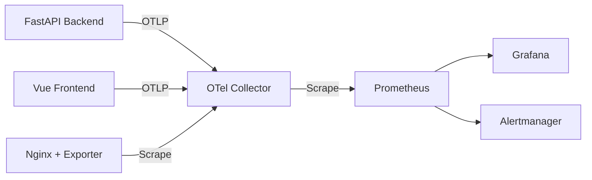

# Observability & Tracing — OBSERVABILITY_SPEC.md

# Observability Specification

Specification defines metrics, monitoring, alerting architecture for full stack.

## Architecture

## Instrumentation Layer

- **Backend (FastAPI)**: Instrument via `prometheus-fastapi-instrumentator`. Emits OpenTelemetry metrics. Targets Latency (< 200ms P95) and Availability (> 99.9%) SLIs.
- **Frontend (Vue)**: Real User Monitoring (RUM) via `@opentelemetry/instrumentation-document-load` and `@opentelemetry/instrumentation-user-interaction`.
- **Proxy (Nginx)**: Exposes metrics via `stub_status` module. Scraped by `nginx-prometheus-exporter`. Tracks active connections, request rates, status codes.

## Collection & Storage Pipeline

- **OpenTelemetry Collector (`otel-collector`)**:
  - Ingests OTLP from backend and frontend.
  - Scrapes `nginx-prometheus-exporter` via Prometheus receiver.
  - Adds `exported_job` label to preserve source service names.
- **Prometheus**:
  - Scrapes `otel-collector` endpoint.
  - Evaluates alerting rules defined in `alerts.yml`.
- **Grafana**:
  - Prometheus configured as primary data source.
  - Pre-built dashboards for backend, frontend, proxy.
- **Alertmanager**:
  - Handles alerts triggered by Prometheus rules.
  - Local dev orchestrated via `podman-compose`.

## Testing & Verification

1. **Generation**: Validate metrics emission on backend, frontend, and `nginx-prometheus-exporter`.
2. **Ingestion**: Query Prometheus to verify OTel Collector scrape success and label preservation.
3. **Alert Validation**: Validate rule syntax via `promtool check rules alerts.yml`. Trigger simulated threshold spikes to verify `FIRING` state.

## Operational Constraints

- **Scope Boundary**: No distributed tracing (Jaeger/Zipkin) or log aggregation (Loki/ELK). No production notification transports (Slack, PagerDuty).
- **Metric Reference**: Detailed metrics catalog documented in `docs/metrics-reference.md`.
- **Known Issue**: Alertmanager container fails on start with `permission denied` on storage volume. Fix: adjust directory ownership (`chown`) or Podman security context.