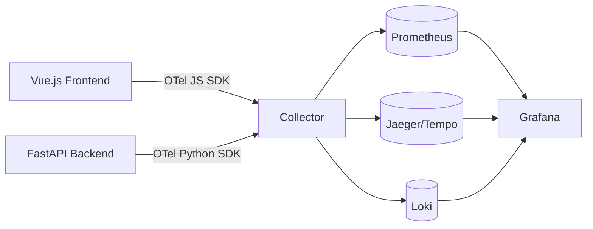

# Observability & Tracing — research

# Observability & Tracing — Research

## Purpose

Design OpenTelemetry integration for FastAPI backend and Vue.js frontend. Collect application metrics, traces, logs. Export to Prometheus, Jaeger/Tempo, Loki via OpenTelemetry Collector. Deploy with Docker Compose.

## Architecture



## Technology Stack

| Layer | Technology |
|-------|------------|
| Backend | FastAPI + OpenTelemetry Python SDK |
| Frontend | Vue.js + OpenTelemetry JavaScript SDK |
| Metrics Export | Prometheus Exporter |
| Traces/Logs Export | OTLP Exporter |
| Collector | OpenTelemetry Collector |
| Visualization | Grafana |
| Deployment | Docker Compose + `docker-compose.override.yml` |

## Key Components

### Backend Instrumentation (Planned)
- **Zero-code instrumentation** — auto-instrument FastAPI, SQLAlchemy, Redis, HTTP clients
- **Process code instrumentation** — custom spans for business logic
- **Route management instrumentation** — per-endpoint latency, error rates
- **FastAPI instrumentation** — request/response hooks, middleware

### Frontend Instrumentation (Planned)
- **Pinia/Vuex instrumentation** — state change tracing
- **Route management instrumentation** — navigation timing, component render spans
- **FastAPI instrumentation** — correlate frontend requests with backend traces

### Collector Configuration
- Receivers: `otlp` (HTTP/gRPC) from backend and frontend
- Processors: `batch`, `memory_limiter`, `resource` (add service.name, deployment.environment)
- Exporters: `prometheus` (metrics), `otlp` (traces → Jaeger/Tempo, logs → Loki)

## Deployment

```yaml
# docker-compose.override.yml (example structure)
services:
  otel-collector:
    image: otel/opentelemetry-collector-contrib
    volumes:
      - ./otel-collector-config.yaml:/etc/otelcol-contrib/config.yaml
    ports:
      - "4317:4317"   # OTLP gRPC
      - "4318:4318"   # OTLP HTTP
      - "8889:8889"   # Prometheus scrape
  prometheus:
    image: prom/prometheus
    volumes:
      - ./prometheus.yml:/etc/prometheus/prometheus.yml
  jaeger:
    image: jaegertracing/all-in-one
  loki:
    image: grafana/loki
  grafana:
    image: grafana/grafana
```

## Current Status

Research phase only. No implementation exists. Decisions documented; code not written.

## Future Work

1. Implement zero-code instrumentation (backend + frontend)
2. Implement process code instrumentation (custom spans)
3. Implement route management instrumentation
4. Implement FastAPI-specific instrumentation
5. Implement Pinia/Vuex instrumentation
6. Define collector config with resource attributes, sampling
7. Add Grafana dashboards for RED metrics, trace exploration, log correlation

## References

- [OpenTelemetry Python SDK](https://docs.opentelemetry.io/python/docs/)
- [OpenTelemetry JavaScript SDK](https://docs.opentelemetry.io/javascript/docs/)
- [OpenTelemetry Collector](https://docs.opentelemetry.io/collector/docs/)
- [Prometheus](https://prometheus.io/docs/)
- [Grafana](https://grafana.com/docs/)
- [Docker Compose](https://docs.docker.com/compose/)