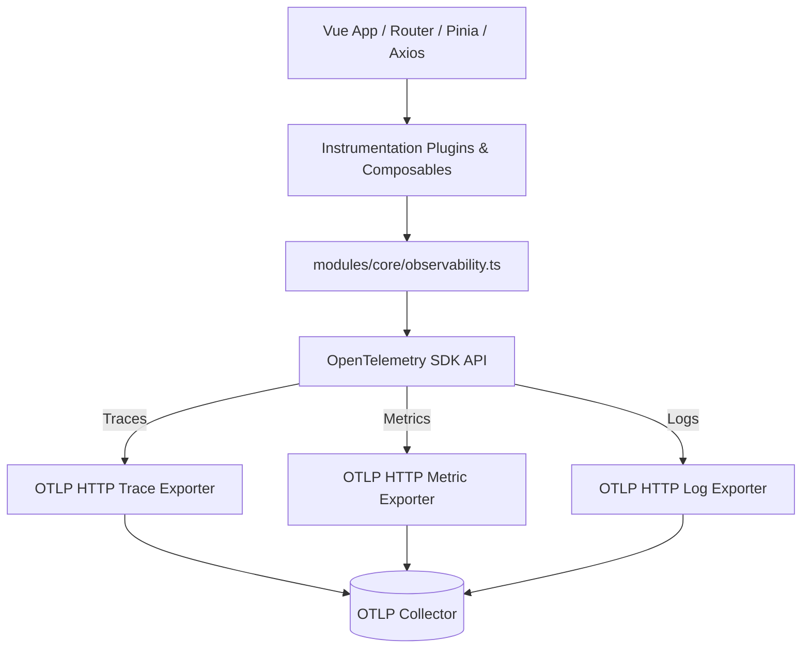

# Observability & Tracing — src

# Observability & Tracing Module

Module configures OpenTelemetry SDK for browser telemetry. Captures distributed traces, custom performance metrics, and logs. Exports data to OTLP collector via HTTP.



---

## Configuration & Environment Variables

Setup uses Vite environment variables. Default endpoints target local OTLP collector:

| Variable | Description | Default |
| :--- | :--- | :--- |
| `VITE_SERVICE_NAME` | Logical service name for all telemetry resources | `frontend-app` |
| `VITE_OTEL_COLLECTOR_URL` | OTLP endpoint for spans | `http://localhost:4318/v1/traces` |
| `VITE_OTEL_METRICS_ENABLED` | Toggle metric export pipeline (`'false'` disables) | `true` |
| `VITE_OTEL_COLLECTOR_METRICS_URL` | OTLP endpoint for metrics | `http://localhost:4318/v1/metrics` |
| `VITE_OTEL_COLLECTOR_LOGS_URL` | OTLP endpoint for logs | `http://localhost:4318/v1/logs` |

---

## Core Initialization

### `setupObservability()`
Location: `frontend/src/modules/core/observability.ts`

Initializes three OpenTelemetry pillars:

1. **Traces**:
   - Creates `WebTracerProvider` with `Resource` service name.
   - Registers `ZoneContextManager` for async context propagation.
   - Attaches auto-instrumentations: `DocumentLoadInstrumentation`, `FetchInstrumentation`, `UserInteractionInstrumentation`.
   - Sends spans immediately via `SimpleSpanProcessor` and `OTLPTraceExporter`.
   - Exports singleton `tracer` instance (`vue-frontend-tracer`).

2. **Metrics**:
   - Creates `MeterProvider` with `PeriodicExportingMetricReader` (30-second export interval).
   - Registers global meter and executes `initializeMetrics()`.

3. **Logs**:
   - Creates `LoggerProvider` with `SimpleLogRecordProcessor` and `OTLPLogExporter`.
   - Emits test initialization log at level 9 (`INFO`).

---

## Metrics System

Location: `frontend/src/modules/core/metrics/metrics.ts`

Meter name: `frontend-app`. Instruments initialized lazily on `initializeMetrics()` call.

### Defined Instruments

| Metric Name | Instrument | Unit | Attributes | Purpose |
| :--- | :--- | :--- | :--- | :--- |
| `frontend.app.page_view` | Counter | `1` | `route.name`, `route.path` | Route transition count |
| `frontend.app.button_click` | Counter | `1` | `element_id`, `element_type`, `page_route` | UI click interactions |
| `frontend.app.form_submit` | Counter | `1` | `form_name`, `page_route` | Form submit events |
| `frontend.app.component_render_duration` | Histogram | `ms` | `component_name`, `route.path` | Component mount time |
| `http.client.duration` | Histogram | `ms` | `http.method`, `http.url`, `http.status_code` | API client latency |

### Metric Functions
- `recordPageView(routeName, routePath)`: Increment page view counter.
- `recordButtonClick(elementId, elementType, pageRoute)`: Track UI click target.
- `recordFormSubmit(formName, pageRoute)`: Track form execution.
- `recordComponentRender(componentName, routePath, duration)`: Record component lifecycle mount latency.
- `recordApiCall(method, url, statusCode, duration)`: Record outgoing HTTP duration with standard semantic conventions.

---

## Vue Composables

### `useComponentRenderMetrics`
Location: `frontend/src/modules/core/metrics/useComponentRenderMetrics.ts`

Measures component mount duration.
- Hook records `performance.now()` in `onBeforeMount`.
- Calculates difference in `onMounted`.
- Resolves component name via `getCurrentInstance()?.type.__name`.
- Calls `recordComponentRender(name, route.path, duration)`.

### `useMetrics`
Location: `frontend/src/modules/core/metrics/useMetrics.ts`

Extracts current route path reactively and exposes UI tracking functions:
- `trackButtonClick(elementId, elementType = 'button')`: Calls `recordButtonClick`.
- `trackFormSubmit(formName)`: Calls `recordFormSubmit`.

---

## Plugins & Instrumentation

### Router Instrumentation
Location: `frontend/src/plugins/router-instrumentation.ts` (and `modules/core/router-observability.ts`)

Function: `routerInstrumentation(router: Router)`
- `router.beforeEach`: Starts span `Navigation to <name|path>`, sets `from` and `to` full path attributes.
- `router.afterEach`: Sets `SpanStatusCode.OK` (or `SpanStatusCode.ERROR` on failure) and ends span.
- `router.onError`: Sets `SpanStatusCode.ERROR` with error message and ends span.

### Axios Instrumentation
Location: `frontend/src/plugins/axios-instrumentation.ts`

Function: `axiosInstrumentation()`
- Intercepts requests: Starts span `http: <METHOD> <URL>`, writes `X-Trace-Id` header to config, attaches span object to request config.
- Intercepts responses: Sets span status `SpanStatusCode.OK` and ends span.
- Intercepts errors: Records exception, sets `SpanStatusCode.ERROR`, ends span, returns rejected promise.

### Pinia Plugin
Location: `frontend/src/plugins/pinia-instrumentation.ts`

Function: `piniaPlugin(context: PiniaPluginContext)`
- Hooks into `$onAction`.
- Starts span `Pinia Action: <actionName>`.
- Adds `store`, `action`, and `args` attributes.
- Closes span on action completion (`after`) with serialized result or on error (`onError`) with error message.

---

## Integration Setup

Initialize observability in application bootstrap entrypoint (`main.ts`):

```typescript
import { createApp } from 'vue';
import { createPinia } from 'pinia';
import router from '@/router';
import App from '@/App.vue';

import { setupObservability } from '@/modules/core/observability';
import { routerInstrumentation } from '@/plugins/router-instrumentation';
import { axiosInstrumentation } from '@/plugins/axios-instrumentation';
import { piniaPlugin } from '@/plugins/pinia-instrumentation';

// 1. Initialize OTel SDK providers
setupObservability();

// 2. Initialize plugins
axiosInstrumentation();

const pinia = createPinia();
pinia.use(piniaPlugin);

routerInstrumentation(router);

// 3. Mount Vue app
const app = createApp(App);
app.use(pinia);
app.use(router);
app.mount('#app');
```