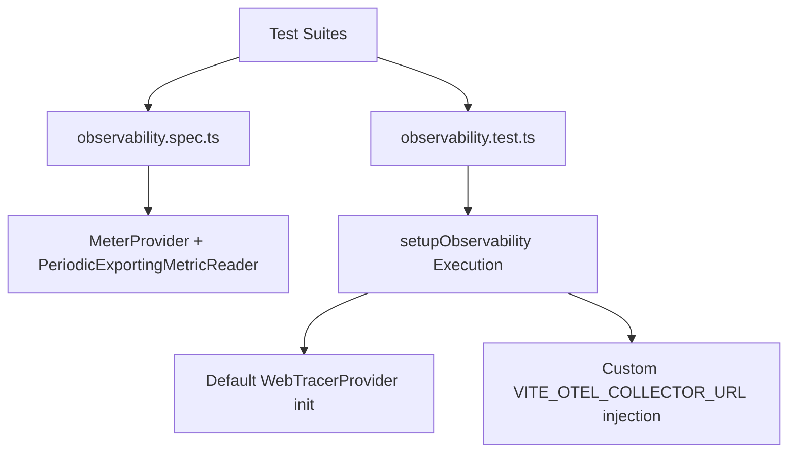

# Observability & Tracing — tests

# Observability & Tracing — Tests

Unit test suites for frontend OpenTelemetry (OTel) metrics and tracing setup.

## Files

- `frontend/tests/modules/core/observability.spec.ts` — Verifies OTel metric provider and counter pipeline.
- `frontend/tests/modules/core/observability.test.ts` — Verifies `setupObservability()` tracing initialization and collector endpoint configuration.

## Test Coverage

### Metrics Suite (`observability.spec.ts`)

Tests OpenTelemetry metric pipeline creation without actual network export.

- **Mocked Module**: `@opentelemetry/exporter-metrics-otlp-http` (`OTLPMetricExporter`).
- **Target Flow**:
  1. Instantiates `MeterProvider`.
  2. Hooks mocked `OTLPMetricExporter` via `PeriodicExportingMetricReader` (100ms interval).
  3. Registers provider via `metrics.setGlobalMeterProvider()`.
  4. Fetches meter `test-meter` and creates counter `test_counter`.
  5. Increments counter (`counter.add(1)`).
  6. Asserts runtime setup completes without error.

### Tracing Suite (`observability.test.ts`)

Tests frontend tracing bootstrap function `setupObservability()`.

- **Mocked Modules**:
  - `@opentelemetry/sdk-trace-web` (`WebTracerProvider`, `SimpleSpanProcessor`, `TraceSDK`)
  - `@opentelemetry/exporter-trace-otlp-http` (`OTLPTraceExporter`)
  - `@opentelemetry/instrumentation-document-load` (`DocumentLoadInstrumentation`)
  - `@opentelemetry/instrumentation-fetch` (`FetchInstrumentation`)
  - `@opentelemetry/instrumentation-user-interaction` (`UserInteractionInstrumentation`)
  - `@opentelemetry/context-zone` (`ZoneContextManager`)

- **Cases**:
  - **Default Collector**: Calls `setupObservability()` with empty environment. Asserts `WebTracerProvider` instantiated.
  - **Custom Collector URL**: Sets `import.meta.env.VITE_OTEL_COLLECTOR_URL = 'http://custom-collector:4318/v1/traces'`. Calls `setupObservability()`. Asserts `OTLPTraceExporter` receives matching `url` parameter.

## Test Configuration & Environment

- **Runner**: Vitest.
- **State Reset**: `beforeEach` resets module registry (`vi.resetModules()`), clears mocks (`vi.clearAllMocks()`), deletes `import.meta.env.VITE_OTEL_COLLECTOR_URL`. Prevents state leak across test runs.