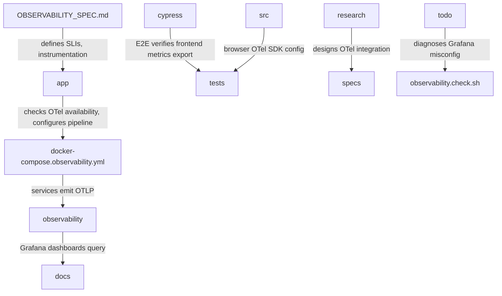

# Observability & Tracing

# Observability & Tracing

**Purpose**  
OpenTelemetry integration for distributed tracing, metrics, and structured logging across backend (FastAPI), frontend (Vue), and infrastructure. Graceful degradation when OTel Collector unreachable. Enables health, performance, and error monitoring via Prometheus, Grafana, Tempo, Loki.

**Sub-modules & Relationships**  
- `OBSERVABILITY_SPEC.md` — Defines metrics, monitoring, alerting architecture. Backend instrumentation via `prometheus-fastapi-instrumentator`; Frontend RUM via `@opentelemetry/instrumentation-document-load` and `@opentelemetry/instrumentation-user-interaction`; Nginx proxy exports. SLIs: Latency <200ms P95, Availability >99.9%.  
- `app` — Main entry `setup_observability(app, engine)`. Checks OTel Collector TCP availability; configures full OTLP pipeline if available, metrics-only if unavailable. Applies instrumentations: FastAPI, HTTPX, SQLAlchemy, system metrics.  
- `docker-compose.observability.yml` — Local dev stack. Application services emit OTLP gRPC/HTTP → OTel Collector → Tempo (traces), Prometheus (metrics), Loki (logs). Grafana visualizes. Jaeger alternate trace UI. Alertmanager routes alerts; telegram-bot placeholder notifications.  
- `observability` — Centralizes metrics, traces, logs for all services. Grafana dashboards (Overall, Backend, Frontend, Nginx) query Prometheus, Tempo, Loki. Prometheus scrapes collector and service metrics.  
- `docs` — Metric reference samples for backend (`job="backend-service"`) and frontend OpenTelemetry + Prometheus pipeline. Architecture diagram of data flow across components.  
- `cypress` — E2E test `observability.cy.ts` verifies frontend OTel metrics export pipeline. Cypress visits frontend, triggers auto-instrumentation, validates metrics reach Collector Prometheus endpoint (:8889).  
- `src` — Browser OpenTelemetry SDK configuration via Vite environment variables. Instrumentation plugins & composables feed Core `observability.ts` → OTel SDK API → OTLP HTTP exporters (traces, metrics, logs) → OTLP Collector.  
- `tests` — Unit suites `observability.spec.ts` and `observability.test.ts` verify OTel metric provider/counter pipeline, `setupObservability()` tracing initialization, collector endpoint configuration. Coverage: `MeterProvider`, `PeriodicExportingMetricReader`, default `WebTracerProvider`, `VITE_OTEL_COLLECTOR_URL` injection.  
- `observability.check.sh` — Standalone health verification after stack deployment. Sequential endpoint checks against localhost ports. Validates response patterns; on failure prints colored error, shows recent logs via `show_service_logs()`. Non-blocking continuation to next check.  
- `research` — Design OTel integration for FastAPI backend and Vue.js frontend. Collect application metrics, traces, logs. Export to Prometheus, Jaeger/Tempo, Loki via OTel Collector. Deploy with Docker Compose.  
- `specs` — Architecture graph: Backend FastAPI → OTelCollector; Frontend Vue.js → OTelCollector. OTelCollector → Prometheus, Jaeger, Loki. Prometheus → Grafana. Jaeger/Loki → Grafana. Backend instrumentation via OpenTelemetry Python SDK.  
- `todo` — `fix_grafana_dashboard.sh` diagnoses why Grafana panels show no data. Checks Prometheus metrics/targets, Loki log labels/sample queries, OTel collector metrics endpoint, backend `/metrics` exposure. Saves output to `metrics-and-labels.txt`.

**Key Workflows Spanning Sub-modules**  
1. **Instrumentation → Export**: Backend FastAPI + Vue emit OTel data (`OBSERVABILITY_SPEC.md`, `src`). Collector receives (`observability`, `specs`). If collector available (`app`), full pipeline; else metrics-only (`app`).  
2. **Collection → Storage → Visualization**: OTel Collector forwards traces to Tempo, metrics to Prometheus, logs to Loki (`docker-compose.observability.yml`, `observability`). Prometheus scrapes; Grafana queries all datasources for dashboards (`observability`, `docs`).  
3. **Verification & Diagnostics**: Health check script (`observability.check.sh`) validates stack export correctness. E2E test (`cypress`) confirms frontend metrics pipeline. Dashboard diagnostic script (`todo`) surfaces misconfiguration.  
4. **Alerting & Notification**: Prometheus alert rules (`observability`) → Alertmanager → telegram-bot placeholder (`docker-compose.observability.yml`).

**[OBSERVABILITY_SPEC.md](OBSERVABILITY_SPEC.md) · [app](app.md) · [docker-compose.observability.yml](docker-compose.observability.yml.md) · [observability](observability.md) · [docs](docs.md) · [cypress](cypress.md) · [src](src.md) · [tests](tests.md) · [observability.check.sh](observability.check.sh.md) · [research](research.md) · [specs](specs.md) · [todo](todo.md)**