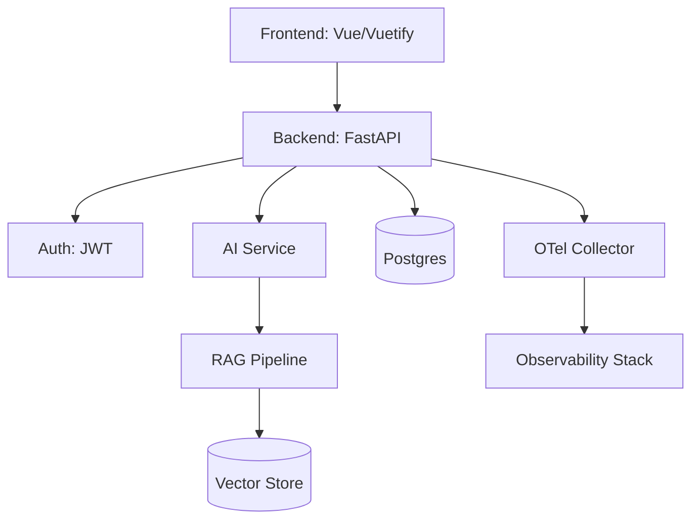

# omnisight-platform-poc — Wiki

# Omnisight Platform POC

Full-stack POC. FastAPI backend. Vue 3 frontend. AI/LLM integration. DevOps ready. Showcase Python, Vue, containerization, cloud-native readiness.

## Architecture

## System Overview

[Core Architecture & Infrastructure](core-architecture.md) manage runtime, persistence, security. [API Routing & Versioning](api-routing.md) handle versioned endpoints. [Authentication & User Management](auth-management.md) secure system via JWT in HttpOnly cookies.

[AI & LLM Services](ai-llm-services.md) orchestrate OpenAI, Anthropic, local models. [RAG Pipeline](rag-pipeline.md) ingest documents into vector stores for grounded generation.

[Frontend Shell & UI Components](frontend-shell.md) use Vue 3 and Vuetify 3. [Dashboard & Analytics](dashboard-analytics.md) show real-time metrics via ApexCharts. [System Administration & Configuration](system-admin.md) manage roles, logs, runtime settings.

[Observability & Tracing](observability-tracing.md) provide full-stack telemetry via OTel, Prometheus, Loki, Tempo. [Deployment & Operations](deployment-ops.md) cover Docker, Kubernetes, CI/CD. [Documentation & Specifications](docs-specs.md) define project standards.

## Key Flows

- **Chat**: User query. `LLMService` process. Provider stream result.
- **RAG**: Document upload. `VectorStore` index. Context retrieval ground LLM.
- **Auth**: Login. JWT cookie store. `get_current_user` verify access.
- **Config**: `get_config` request. `verify_token` check. `get_db` fetch data.

## Quick Start

1. Clone repo.
2. Run `docker-compose up`.
3. Run `alembic upgrade head`.
4. Access UI at `localhost:80`.