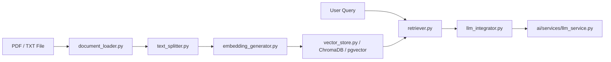

# RAG Pipeline

# RAG Pipeline Module

RAG module handle ingest, embed, index, retrieve, prompt augment for LLM context grounding.



---

## Core Components

### 1. Document Loading (`document_loader.py`)
Extract raw text to LangChain `Document` objects.
- `load_document(file_path)`: Inspect file extension. PDF use `PyPDFLoader`. TXT use `TextLoader` with UTF-8. Other extensions throw `ValueError`.
- `load_documents_from_directory(directory_path)`: Iterate folder, process matching `.pdf` and `.txt` files. Catch and log per-file errors without breaking loop.

### 2. Text Splitting (`text_splitter.py`)
Chunk documents for token limit fit and search granularity.
- `split_documents(documents, chunk_size=1000, chunk_overlap=200)`: Wrapper over LangChain `RecursiveCharacterTextSplitter`. Preserve source metadata across chunks.

### 3. Embedding Generation (`embedding_generator.py`)
Transform text chunks to vectors.
- Class: `EmbeddingGenerator(model_name='all-MiniLM-L6-v2')`
  - Initialize HuggingFace `SentenceTransformer`. Vector size: 384 dimensions.
  - `generate_embedding(text)`: Output single `list[float]`.
  - `generate_embeddings(texts)`: Output batch `list[list[float]]`.

### 4. Ingestion Pipeline (`ingestion_service.py`)
Glue loading, splitting, embedding, persistence.
- `ingest_document(file_path, chunk_size, chunk_overlap)`: Read file, chunk text, calculate embeddings, write embeddings to chunk metadata dict. Return `List[Document]`.
- `ingest_documents_from_directory(directory_path, chunk_size, chunk_overlap)`: Batch ingest directory chunks with embedded metadata.
- `ingest_and_store_document(file_path, chunk_size, chunk_overlap)`: Async. Run `ingest_document`, format docs into `{id, embedding, document, metadata}`, call `VectorStore.add_documents()`.
- `ingest_and_store_documents_from_directory(directory_path, chunk_size, chunk_overlap)`: Async directory ingestion with vector store persistence.

### 5. Vector Storage & Schema (`vector_store.py`, `models.py`)
- **ChromaDB wrapper (`vector_store.py`)**:
  - `VectorStore(persist_directory="./chroma_db", collection_name="rag_documents")`: Manage `chromadb.PersistentClient`.
  - `add_documents(documents)`: Batch push IDs, vectors, content strings, metadata.
  - `query(query_embedding, n_results=5)`: Nearest neighbor vector lookup.
  - `get_vector_store()`: Global singleton factory.
- **Relational DB fallback (`models.py`)**:
  - Model `Document(Base)`: SQL table `documents`.
  - Columns: `id` (Integer PK), `content` (Text), `embedding` (`Vector(384)` via `pgvector`), `meta_data` (JSON), `created_at` (DateTime).

### 6. Retrieval Engine (`retriever.py`, `retrieval_service.py`)
- **Search orchestration (`retriever.py`)**:
  - `generate_query_embedding(query)`: Helper for query vector generation.
  - `retrieve(query, n_results=5, filter_metadata=None)`: Convert query string to vector, query `VectorStore`, reformat response into Chroma shape (`ids`, `documents`, `metadatas`, `distances`).
  - `retrieve_with_embedding(query_embedding, n_results=5, filter_metadata=None)`: Direct search with pre-computed vector.
- **API route (`retrieval_service.py`)**:
  - `POST /retrieve`: Accept `RetrievalRequest` (`query: str`, `n_results: int = 5`), invoke `retrieve()`, return match payload.

### 7. LLM Integration (`llm_integrator.py`)
Format vector search outputs for context prompts.
- `format_context_for_llm(documents)`: Join `page_content` list into numbered blocks (`Document 1:\n...`).
- `generate_rag_prompt(query, context, template)`: Interpolate `{context}` and `{query}` into template string.

### 8. Experiment Tracking (`mlflow_tracker.py`)
Track parameters, run metrics, model configs in MLflow.
- `init_mlflow_tracking(experiment_name, tracking_uri)`: Configure MLflow endpoint and active experiment.
- `log_embedding_model_params(model_name)`: Track model identifier.
- `log_rag_params(chunk_size, chunk_overlap, n_results)`: Track chunking/retrieval hyperparameters.
- `log_llm_metrics(model, usage, finish_reason)`: Track token count metrics (`prompt_tokens`, `completion_tokens`, `total_tokens`).
- `register_rag_components(...)`: Save complete RAG setup as run config tag `rag_pipeline_config`.
- `register_rag_model(run_id, model_name, model_path)`: Add artifact to MLflow Model Registry.

---

## Integration Points

| Source | Target | Operation |
|---|---|---|
| `app.modules.ai.api.chat.rag_chat_completion` | `retriever.retrieve` | Fetch relevant context for user chat input |
| `ingestion_service` / `retriever` | `app.modules.ai.services.vector_store_factory` | Fetch initialized vector backend |
| `llm_integrator` | `app.modules.ai.services.llm_service` | Inject formatted context into LLM system/user prompts |

---

## Testing

Unit and integration tests located in `tests/`:
- `test_document_processing.py`: Validate loaders, unsupported file rejection, text chunking bounds.
- `test_embedding_vector.py`: Test `SentenceTransformer` wrappers and Chroma client ops.
- `test_integration.py`: End-to-end checks for chat completions, streaming chat, and ingestion retrieval loops.
- `test_mlflow.py`: Validate telemetry hooks and experiment parameter tracking.

Run tests:
```bash
pytest backend/app/modules/llm/rag/tests/
```