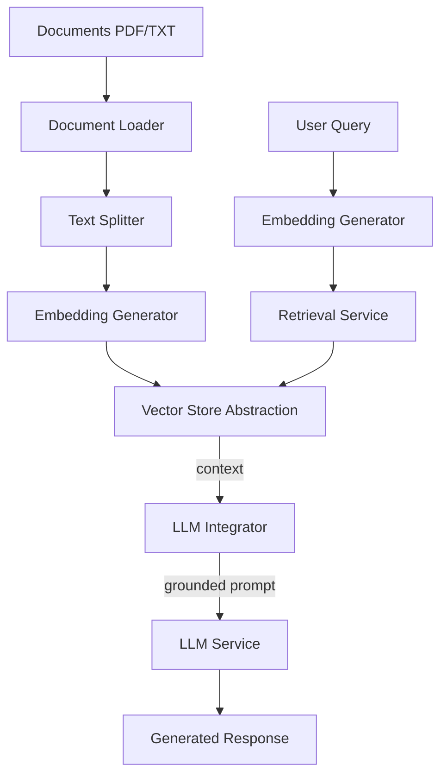

# AI & RAG Orchestration

## AI Strategy & RAG Pipeline Architecture

This document details the implementation of the Retrieval-Augmented Generation (RAG) pipeline and LLM orchestration within the Omnisight platform, focusing on algorithm design, system integration, and performance optimization.

## RAG Pipeline Design

### Architecture
The pipeline consists of a series of decoupled services coordinated by an ingestion orchestrator:



### Core Components

#### 1. Document Ingestion
- **Loaders**: LangChain-based loaders for extracting content from PDF and TXT files.
- **Splitters**: `RecursiveCharacterTextSplitter` with 1000 character chunks and 200 character overlap.
- **Rationale**: Overlap ensures semantic continuity across chunks, improving retrieval accuracy.

#### 2. Embedding Generation
- **Model**: `all-MiniLM-L6-v2` (Sentence-Transformer).
- **Dimension**: 384-dimensional vector space.
- **Performance**: High-speed embedding generation suitable for real-time document processing.

#### 3. Vector Store Abstraction
A flexible interface enables swapping implementations:

```python
# backend/app/modules/llm/rag/vector_store.py
class VectorStore(ABC):
    @abstractmethod
    def add(self, texts: List[str], metadatas: List[Dict]): ...
    
    @abstractmethod
    def search(self, query: str, k: int = 5): ...
```

#### 4. Retrieval & Similarity Search
- **Similarity Metric**: Cosine distance.
- **Optimization**: HNSW index for sub-linear search time.
- **Metadata Filtering**: Support for filtering search results by user, date, or category.

#### 5. LLM Integration
- **Prompt Orchestration**: Dynamic prompt construction combining system instructions, retrieved context, and user query.
- **Streaming**: Token-based streaming responses for better user experience.

## AI Design Decisions

### Decision 1: Hybrid Vector Database Strategy
- **Local Dev**: ChromaDB (zero infrastructure, file-based).
- **Production**: PGVector (PostgreSQL extension, ACID compliant, existing infra).
- **Benefit**: Smooth development workflow with production-grade reliability.

### Decision 2: Multi-Provider LLM Orchestration
- **Supported Providers**: OpenAI, Anthropic, Local (via swappable providers).
- **Registry Pattern**: Centralized mapping of model names to LLM configurations.
- **Benefit**: Avoid vendor lock-in and enable fallback options.

### Decision 3: Rate Limiting & Budget Protection
- **Implementation**: Middleware-based throttling of LLM requests.
- **Context**: LLM inference is expensive and latency-heavy.
- **Benefit**: Protect system resources and budget from excessive usage.

## AI Performance Optimization

### Vector Search Optimization (HNSW Index)
Implemented HNSW (Hierarchical Navigable Small World) index for efficient approximate nearest neighbor search:

```sql
CREATE INDEX idx_documents_embedding_hnsw ON documents 
USING hnsw (embedding vector_cosine_ops) 
WITH (m = 16, ef_construction = 64);
```

**Impact**: Reduces search complexity from $O(N)$ to $O(log N)$, enabling sub-second retrieval across millions of documents.

### Embedding Caching
Strategies for reducing redundant embedding generation:
1. **Hash-based Caching**: Store embeddings indexed by text hash.
2. **Metadata-aware Ingestion**: Skip re-processing of unchanged documents.

## MLflow & Experiment Tracking

The system integrates with MLflow to track pipeline performance:
- **Parameters**: Chunk size, overlap, model version.
- **Metrics**: Retrieval precision, generation latency, token usage.
- **Reproducibility**: Versioned pipeline configurations.

## Future Enhancements

1. **Hybrid Search**: Combine vector search with BM25 keyword search.
2. **Re-ranking**: Add a second-stage cross-encoder for better context relevance.
3. **Advanced RAG Patterns**: Implementation of Multi-query, Sub-query, and HyDE strategies.
4. **Local Fine-tuning**: Domain-specific model fine-tuning for improved accuracy.

## Conclusion

The AI architecture provides a robust, extensible foundation for RAG-based applications. By combining flexible abstractions with optimized indexing and multi-provider support, the platform delivers high-performance, intelligent retrieval and generation capabilities that scale with organizational needs.