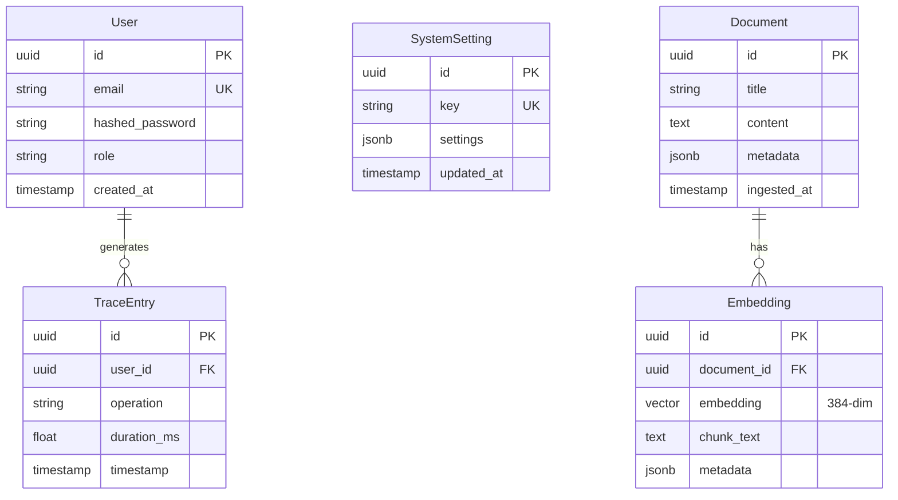

# Data & Database Design

## Database Architecture & Software Application

This document covers the database design, optimization strategies, and data management practices implemented in the Omnisight platform.

## Database Technology Stack

| Component | Technology | Purpose |
|-----------|-----------|---------|
| Primary DB | PostgreSQL | Relational data storage |
| Vector Extension | pgvector | Vector similarity search |
| ORM | SQLAlchemy 2.0 | Python object-relational mapping |
| Migrations | Alembic | Schema version control |
| Dev Vector DB | ChromaDB | Local development vector store |
| Connection Pool | SQLAlchemy Pool | Connection management |

## Database Schema Design

### Entity Relationship Model



### Design Principles
1. **UUID Primary Keys**: Distributed-safe, no auto-increment conflicts
2. **JSONB for Flexible Data**: System settings stored as JSONB for schema flexibility
3. **Vector Column**: pgvector `vector(384)` type for embedding storage
4. **Metadata Columns**: JSONB metadata for extensible document attributes

## Query Optimization

### 1. N+1 Query Elimination
**Problem**: Lazy-loaded relationships trigger N additional queries.

```python
# Before: 1 + N queries
users = db.query(User).all()
for user in users:
    roles = user.roles  # triggers query per user

# After: 1 query with JOIN
users = db.query(User).options(joinedload(User.roles)).all()
```

### 2. JSONB Index Optimization
**Problem**: Sequential scan on nested JSON paths.

```sql
-- GIN index for JSONB containment queries
CREATE INDEX idx_system_settings_jsonb_gin 
ON system_settings USING gin (settings);
```

```python
# Optimized: uses GIN index, O(log N)
settings = db.query(SystemSetting).filter(
    SystemSetting.settings.contains({"tracing": {"enabled": True}})
).all()
```

### 3. Vector Similarity Search (HNSW)
**Problem**: Exact nearest neighbor search is O(N).

```sql
-- HNSW index for approximate nearest neighbor
CREATE INDEX idx_documents_embedding_hnsw ON documents 
USING hnsw (embedding vector_cosine_ops) 
WITH (m = 16, ef_construction = 64);
```

**Impact**: Sub-linear search time, suitable for 1M+ documents.

### 4. Read Replica Architecture
**Design**: Automatic query routing based on operation type.

```python
class RoutingSession(Session):
    def get_bind(self, mapper=None, clause=None):
        if self._flushing or (clause is not None and not clause.is_select):
            return engines['writer']  # Primary
        return engines['reader']       # Replica

engines = {
    'writer': create_engine(settings.DATABASE_WRITE_URL, pool_size=10, max_overflow=20),
    'reader': create_engine(settings.DATABASE_READ_URL, pool_size=15, max_overflow=30)
}
```

## Migration Strategy

### Alembic Configuration
- **Auto-generation**: Schema changes detected from SQLAlchemy models
- **Versioning**: Sequential migration files with upgrade/downgrade support
- **Docker Integration**: Automatic migration on container startup (`RUN_MIGRATIONS=true`)

### Migration Workflow
```bash
# Generate migration
alembic revision --autogenerate -m "add_embedding_table"

# Apply migrations
alembic upgrade head

# Rollback
alembic downgrade -1
```

## Connection Management

### SQLAlchemy Pool Configuration
```python
engine = create_engine(
    DATABASE_URL,
    pool_size=10,        # Persistent connections
    max_overflow=20,     # Burst capacity
    pool_pre_ping=True,  # Connection health checks
    pool_recycle=3600    # Recycle stale connections
)
```

### Scaling Strategy
| Load Level | Pool Size | Max Overflow | Notes |
|------------|-----------|-------------|-------|
| Development | 5 | 10 | Local PostgreSQL |
| Staging | 10 | 20 | Shared database |
| Production | 10 | 20 | With read replicas |
| High Load | 15 | 30 | Dedicated replicas |

## Data Security

### Access Control
- **Row-Level Security**: User-scoped queries via dependency injection
- **Password Hashing**: bcrypt with salt for user credentials
- **JWT Authentication**: Stateless token-based access control

### Data Integrity
- **ACID Compliance**: PostgreSQL transactions for data consistency
- **Foreign Keys**: Referential integrity enforcement
- **Constraints**: NOT NULL, UNIQUE, CHECK constraints
- **Validation**: Pydantic models for input validation before DB operations

## Vector Database Design

### Hybrid Strategy
| Environment | Store | Rationale |
|-------------|-------|-----------|
| Development | ChromaDB | Zero infrastructure, fast iteration |
| Production | PGVector | ACID, single backup, existing infra |

### Abstraction Layer
```python
class VectorStore(ABC):
    @abstractmethod
    def add(self, texts, metadatas): ...
    
    @abstractmethod
    def search(self, query, k=5): ...

class ChromaVectorStore(VectorStore): ...
class PGVectorStore(VectorStore): ...
```

**Factory Pattern**: `VectorStoreFactory` provides the configured implementation via environment variable.

## Performance Monitoring

### Database Metrics
- **Query Latency**: P50/P95/P99 response times
- **Connection Pool**: Active/idle/overflow counts
- **Slow Queries**: Logged and alerted above threshold
- **Index Usage**: Monitor index hit ratios

## Conclusion

The database architecture delivers:

1. **Scalability**: Read replicas and connection pooling for high throughput
2. **Flexibility**: JSONB and vector types for diverse data patterns
3. **Performance**: Systematic query optimization with proper indexing
4. **Reliability**: ACID compliance with migration versioning
5. **Maintainability**: Clear abstractions and automated schema management