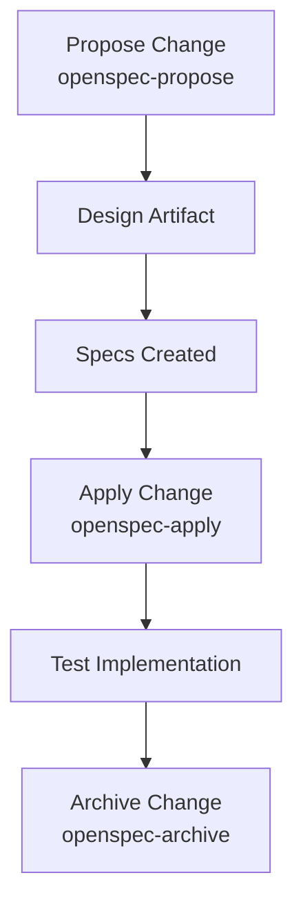

# Development Workflow & Task Management

## Engineering Workflow & Performance Management

This document details the development workflow, change management practices, and task allocation strategies used in the Omnisight platform, demonstrating proficiency in project planning and performance-oriented development.

## Change Management (OpenSpec Workflow)

### Structured Change Process

The platform uses OpenSpec for spec-driven development with a rigorous change management approach:



### Workflow Commands
| Command | Purpose | Output |
|---------|---------|--------|
| `/opsx-propose` | Create new change proposal | Design docs + specs |
| `/opsx-apply` | Implement the change | Code modifications |
| `/opsx-update` | Modify existing change | Revised artifacts |
| `/opsx-archive` | Mark as complete | Archived change |

### Change Artifact Structure
```
openspec/changes/archive/YYYY-MM-DD-change-name/
├── design.md          # Design decisions & rationale
├── proposal.md        # Business requirements
├── specs/             # Detailed specifications
│   └── feature/spec.md
└── tasks/             # Implementation tasks
    ├── implementation.md
    └── review-checklist.md
```

## Development Processes

### Git Workflow
1. **Feature Branches**: `feature/<change-name>` for isolated development
2. **Pull Requests**: Mandatory review with test coverage requirement
3. **Merge Strategy**: Squash-and-merge to maintain clean history
4. **Conflict Resolution**: Regular rebase to minimize merge conflicts

### Code Review Process
| Stage | Requirements |
|-------|--------------|
| PR Creation | Description, related issue, task list |
| Review | Minimum 1 reviewer, CI check pass |
| Merge | Approval + Coverage ≥ 80% |

### Task Allocation Pattern
Tasks are assigned based on:
1. **Complexity Analysis**: Using knowledge graph for impact assessment
2. **Ownership Domain**: Module boundaries define task ownership
3. **Skill Matching**: Task type aligned with developer expertise

## Performance & Performance Management

### Team Performance Metrics
| Metric | Target | Monitoring |
|--------|--------|------------|
| Lead Time | < 2 days | GitHub Insights |
| Deployment Frequency | Daily | CI/CD logs |
| Mean Time to Recovery | < 2 hours | Incident logs |
| Change Failure Rate | < 5% | Rollback metrics |

### Performance Optimization Practices
1. **Query Analysis**: Systematic optimization of N+1, index usage, vector search
2. **CI/CD Efficiency**: Parallel test execution, caching, selective test runs
3. **Resource Utilization**: Container resource limits, auto-scaling thresholds

## Testing & Quality Assurance Workflow

### Test-Driven Development
1. **Red Phase**: Write failing test for new feature
2. **Green Phase**: Implement minimal code to pass test
3. **Refactor Phase**: Optimize and clean implementation

### Test Coverage Management
- **Unit Tests**: > 90% coverage per module
- **Integration Tests**: API and database integration
- **E2E Tests**: Critical user flows (login, chat, ingestion)

## Documentation & Knowledge Management

### Living Documentation
Documentation maintained as code:
- **OpenWiki**: Auto-generated from codebase structure
- **ADRs**: Architecture decisions with rationale
- **In-code Comments**: For complex algorithms and patterns

### Knowledge Sharing
- **Code Reviews**: Pair programming for complex changes
- **Architecture Walkthroughs**: Before major releases
- **Post-mortems**: For incidents, actionable takeaways

## Performance Optimization in Development

### Local Development Efficiency
| Aspect | Optimization | Impact |
|--------|--------------|--------|
| Docker Build | Multi-stage, layer caching | 60% faster builds |
| Test Suite | Parallel execution, selective runs | 3x faster CI |
| Hot Reload | Vite HMR, uv package manager | Instant feedback |

### Scaling for Performance
- **Read Replicas**: Offload query-heavy workloads
- **Connection Pooling**: Efficient database connections
- **Vector Index**: HNSW for sub-linear search

## Conclusion

The development workflow demonstrates:

1. **Structured Process**: Rigorous change management with OpenSpec
2. **Measurable Outcomes**: Performance metrics tracked and improved
3. **Quality Focus**: Test-driven development with coverage gates
4. **Knowledge Transfer**: Documentation-first approach
5. **Performance Mindset**: Systematic optimization across stack
6. **Scalability Planning**: Architecture designed for growth