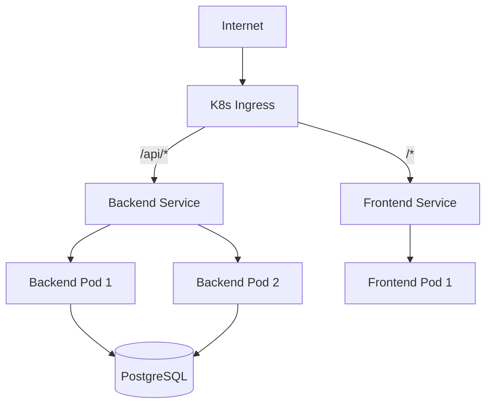
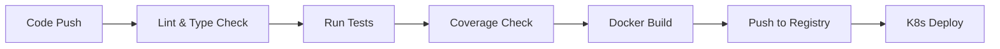

# DevOps & Deployment

## Infrastructure, Containerization & Deployment Strategy

This document covers the DevOps practices, containerization strategy, and deployment architecture of the Omnisight platform.

## Container Architecture

### Docker Compose (Development)

The development environment uses Docker Compose to orchestrate all services:

```yaml
# Service topology
backend:        # FastAPI (port 8000)
frontend:       # Vue.js (port 5173)
postgres:       # PostgreSQL (port 5432)
otel-collector: # OpenTelemetry Collector
prometheus:     # Metrics (port 9090)
grafana:        # Dashboards (port 3000)
loki:           # Logs
tempo:          # Traces
alertmanager:   # Alerts (port 9093)
nginx-exporter: # Nginx metrics
```

### Docker Build Optimization

#### Backend Dockerfile
- **Base Image**: Python 3.11-slim
- **Package Manager**: `uv` for fast dependency resolution
- **Multi-stage**: Build and runtime separation
- **Migration Support**: Auto-run Alembic migrations via `docker-entrypoint.sh`

#### Frontend Dockerfile
- **Build Stage**: Node.js with npm
- **Runtime Stage**: Nginx for static file serving
- **Configuration**: Custom nginx.conf for SPA routing

## Kubernetes Deployment (Production)

### GKE Architecture



### Deployment Manifests

#### Backend Deployment
```yaml
# kubernetes/backend-deployment.yaml
apiVersion: apps/v1
kind: Deployment
spec:
  replicas: 2
  template:
    spec:
      containers:
      - name: backend
        resources:
          requests:
            cpu: "250m"
            memory: "512Mi"
          limits:
            cpu: "1000m"
            memory: "1Gi"
```

#### Horizontal Pod Autoscaler
```yaml
apiVersion: autoscaling/v2
kind: HorizontalPodAutoscaler
spec:
  minReplicas: 2
  maxReplicas: 10
  metrics:
  - type: Resource
    resource:
      name: cpu
      target:
        averageUtilization: 70
```

### Ingress Configuration
- **Host-based Routing**: Separate hosts for frontend and backend
- **Path-based Routing**: `/api/*` to backend, `/*` to frontend
- **TLS Termination**: SSL certificates managed by cert-manager

## CI/CD Pipeline

### GitHub Actions Workflows

| Workflow | Trigger | Purpose |
|----------|---------|---------|
| `python-coverage.yml` | Push/PR | Backend test coverage |
| Build & Deploy | Tag push | Docker build + K8s deploy |

### Pipeline Stages



## Deployment Script

### `deploy-k8s.sh`
Automates the full deployment lifecycle:

1. **Build**: Docker images for backend and frontend
2. **Push**: Images to Google Container Registry (GCR)
3. **Apply**: Kubernetes manifests to GKE cluster
4. **Verify**: Health check endpoints

## Observability Stack Deployment

### Docker Compose Observability
Separate compose file for observability services:

```yaml
# docker-compose.observability.yml
services:
  otel-collector:
    image: otel/opentelemetry-collector
    config: collector-config.yml
  
  prometheus:
    image: prom/prometheus
    config: prometheus.yml
    alerts: [alerts.yml, slo-alert.rules]
  
  grafana:
    image: grafana/grafana
    provisioning: dashboards/ + datasources/
  
  loki:
    image: grafana/loki
    config: loki-config.yml
  
  tempo:
    image: grafana/tempo
    config: tempo-config.yml
```

## Environment Management

### Configuration Strategy
| Environment | Config Source | Database | Vector Store |
|-------------|-------------|----------|-------------|
| Local | `.env` file | SQLite (tests) | ChromaDB |
| Docker Dev | `.env` + compose | PostgreSQL | ChromaDB |
| Staging | K8s ConfigMap | PostgreSQL | PGVector |
| Production | K8s Secret | PostgreSQL | PGVector |

### Secret Management
- **Local**: `.env` file (gitignored)
- **CI/CD**: GitHub Secrets
- **Kubernetes**: K8s Secrets with RBAC

## Infrastructure as Code

### Key Configuration Files
| File | Purpose |
|------|---------|
| `docker-compose.yml` | Development services |
| `docker-compose.observability.yml` | Monitoring stack |
| `docker-compose.prod.yml` | Production overrides |
| `kubernetes/backend-deployment.yaml` | Backend K8s manifest |
| `kubernetes/frontend-deployment.yaml` | Frontend K8s manifest |
| `kubernetes/ingress.yaml` | Ingress routing |
| `deploy-k8s.sh` | Deployment automation |

## Conclusion

The DevOps architecture ensures:

1. **Reproducibility**: Docker-based environments with version-pinned dependencies
2. **Scalability**: Kubernetes with HPA for automatic scaling
3. **Observability**: Full monitoring stack deployed alongside application
4. **Automation**: CI/CD pipelines with quality gates
5. **Security**: Secret management and RBAC across environments