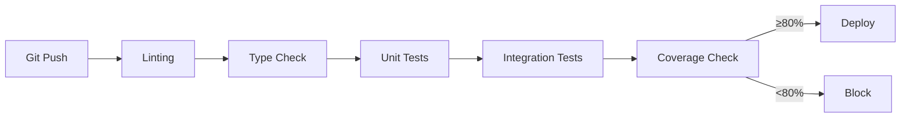

# Quality Engineering & QA

## Software Quality Assurance Strategy

This document outlines the comprehensive software quality assurance practices implemented in the Omnisight platform, covering testing strategy, code quality standards, CI/CD integration, and quality metrics.

## Testing Architecture

### Multi-Layer Testing Strategy

```
┌─────────────────────────────────────────────────┐
│                 E2E Tests (Cypress)              │
│  ● User flows ● Observability verification       │
├─────────────────────────────────────────────────┤
│              Integration Tests                   │
│  ● API endpoints ● Database operations           │
│  ● Cross-module interactions                     │
├─────────────────────────────────────────────────┤
│                 Unit Tests                       │
│  ● Functions ● Components ● Services ● Stores   │
└─────────────────────────────────────────────────┘
```

### Backend Testing (Python / Pytest)

#### Test Infrastructure
- **Framework**: Pytest with async support (`pytest-asyncio`)
- **HTTP Client**: HTTPX for async endpoint testing
- **Database**: SQLite in-memory for test isolation
- **Fixtures**: Centralized in `conftest.py` for consistent test setup

#### Test Categories
| Category | File Pattern | Purpose |
|----------|-------------|---------|
| Health API | `test_api_health.py` | Readiness and liveness probes |
| Configuration | `test_config.py` | Environment variable validation |
| Database | `test_database.py` | Connection pooling, session management |
| CORS | `test_api_cors.py` | Cross-origin request handling |
| Error Handling | `test_api_errors.py` | Standardized error responses |
| System | `test_docs_mount.py` | Internal documentation serving |

#### Test Fixtures Pattern
```python
# tests/conftest.py
@pytest.fixture
def db_session():
    engine = create_engine("sqlite:///:memory:")
    Base.metadata.create_all(engine)
    session = SessionLocal(bind=engine)
    yield session
    session.close()

@pytest.fixture
def client(db_session):
    app.dependency_overrides[get_db] = lambda: db_session
    with TestClient(app) as c:
        yield c
```

### Frontend Testing (TypeScript / Vitest)

#### Test Infrastructure
- **Framework**: Vitest with Happy DOM environment
- **Component Testing**: @vue/test-utils for Vue 3 components
- **Mocking**: Vuetify CSS mocking for SSR compatibility
- **Coverage**: Built-in coverage reporting

#### Test Categories
| Category | File | Purpose |
|----------|------|---------|
| Components | `App.spec.ts` | Component rendering and interaction |
| Stores | `theme.spec.ts` | Pinia store state management |
| Services | `api.spec.ts` | API client behavior |
| Router | `index.spec.ts` | Route configuration and guards |

#### Test Configuration
```typescript
// vitest.config.ts
export default defineConfig({
  test: {
    environment: 'happy-dom',
    globals: true,
    css: { inline: ['vuetify'] }
  }
});
```

### E2E Testing (Cypress)

#### Observability E2E Tests
- **File**: `frontend/cypress/e2e/observability.cy.ts`
- **Purpose**: Verify telemetry data flow from frontend to Grafana dashboards
- **Scope**: Component render metrics, user interaction tracking, API latency

## Code Quality Standards

### Static Analysis
| Tool | Language | Purpose |
|------|----------|---------|
| TypeScript | Frontend | Type safety, compile-time error detection |
| vue-tsc | Frontend | Vue-specific type checking |
| Ruff/Flake8 | Backend | Python linting and style enforcement |
| Pydantic | Backend | Runtime data validation |

### Type Safety
- **Frontend**: Full TypeScript strict mode with `vue-tsc --noEmit`
- **Backend**: Pydantic models for request/response validation
- **API**: Type-safe dependency injection via FastAPI

### Code Organization
1. **Single Responsibility**: Each module owns its domain
2. **Separation of Concerns**: API → Service → Repository layers
3. **DRY**: Shared utilities in `core/` module
4. **SOLID**: Interface-based abstractions (e.g., VectorStore)

## CI/CD Quality Gates

### Automated Pipeline



### Coverage Enforcement
- **Backend Target**: ≥80% line coverage
- **CI Integration**: GitHub Actions workflow (`python-coverage.yml`)
- **Reporting**: Coverage XML reports uploaded as artifacts
- **Blocking**: PR blocked if coverage falls below threshold

### GitHub Actions Workflow
```yaml
# .github/workflows/python-coverage.yml
- name: Run tests with coverage
  run: pytest --cov --cov-report=xml

- name: Check coverage threshold
  run: |
    COVERAGE=$(python -c "...")
    if [ "$COVERAGE" -lt "80" ]; then
      echo "::warning::Coverage below 80%"
    fi
```

## Quality Metrics & Monitoring

### Application Quality
| Metric | Target | Alert |
|--------|--------|-------|
| API Latency P95 | < 200ms | HighBackendLatency |
| Error Rate | < 5% | HighErrorRate |
| Availability | > 99.9% | ServiceDown |
| Frontend Render P95 | < 500ms | HighFrontendLatency |

### Code Quality
| Metric | Target | Tool |
|--------|--------|------|
| Test Coverage | ≥ 80% | Pytest-cov / Vitest |
| Type Safety | 100% strict | TypeScript / Pydantic |
| Lint Compliance | 0 errors | ESLint / Ruff |

## Testing Best Practices

### Test Design Principles
1. **Isolation**: Each test is independent, uses in-memory databases
2. **Determinism**: No reliance on external services
3. **Speed**: Unit tests complete in < 5 seconds
4. **Clarity**: Test names describe expected behavior

### Mocking Strategy
- **Database**: SQLite in-memory with FastAPI dependency overrides
- **External APIs**: Mock responses for LLM providers
- **Browser**: Happy DOM for frontend component testing
- **Network**: Intercepted HTTP requests in Cypress

## Conclusion

The quality engineering approach ensures reliable software delivery through:

1. **Comprehensive Coverage**: Multi-layer testing from unit to E2E
2. **Automated Enforcement**: CI/CD gates prevent quality regression
3. **Type Safety**: Compile-time error prevention across the stack
4. **Observability**: Real-time quality metrics with SLO-based alerting
5. **Standards Compliance**: Consistent coding standards and review processes